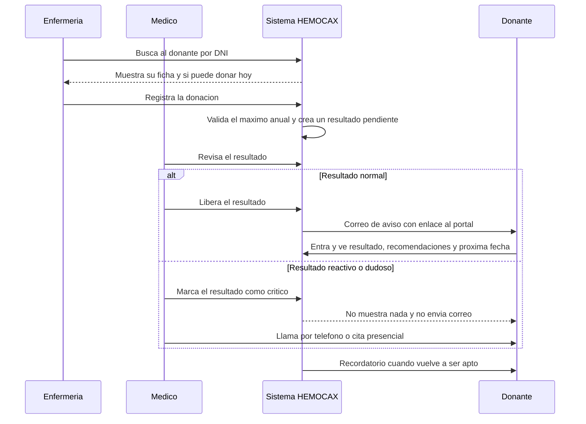
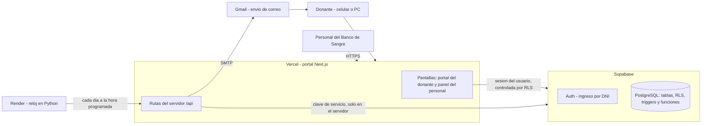

# HEMOCAX

Plataforma digital para fortalecer la **captación, fidelización y retención del donante voluntario de sangre** del Servicio de Hemoterapia y Banco de Sangre del Hospital Regional Docente de Cajamarca (HRDC).

Proyecto de proyección universitaria · Escuela Académico Profesional de Ingeniería de Sistemas · Universidad Nacional de Cajamarca · 2026.

- Portal en producción: https://hemocax.vercel.app
- Documento de referencia del proyecto: *Proyecto HEMOCAX HRDC 2026* (presentado a la Dirección General del HRDC).

> **Resumen en 30 segundos.** HEMOCAX es un portal web con dos caras. El **personal del Banco de Sangre** registra donantes y donaciones, libera resultados y convoca por correo. El **donante** entra con su DNI y ve, en una sola pantalla, si ya puede volver a donar, su resultado, las campañas y dónde donar. Un reloj automático le recuerda cuándo vuelve a ser apto, le agradece y lo saluda en su cumpleaños. Todo con consentimiento expreso, bitácora de auditoría y sin comunicar nunca resultados críticos por medios digitales.

---

## Contenido

1. [El problema y la propuesta](#1-el-problema-y-la-propuesta)
2. [Objetivos del proyecto y cómo se cumplen](#2-objetivos-del-proyecto-y-cómo-se-cumplen)
3. [Cómo funciona, paso a paso](#3-cómo-funciona-paso-a-paso)
4. [Quién puede hacer qué (roles)](#4-quién-puede-hacer-qué-roles)
5. [Reglas de negocio](#5-reglas-de-negocio)
6. [Automatizaciones](#6-automatizaciones)
7. [Arquitectura](#7-arquitectura)
8. [Modelo de datos](#8-modelo-de-datos)
9. [Seguridad y protección de datos personales](#9-seguridad-y-protección-de-datos-personales)
10. [Pantallas](#10-pantallas)
11. [Decisiones de diseño y por qué](#11-decisiones-de-diseño-y-por-qué)
12. [Cómo ejecutarlo y desplegarlo](#12-cómo-ejecutarlo-y-desplegarlo)
13. [Estructura del repositorio](#13-estructura-del-repositorio)
14. [Alcance, límites y trabajo futuro](#14-alcance-límites-y-trabajo-futuro)
15. [Preguntas probables en la sustentación](#15-preguntas-probables-en-la-sustentación)
16. [Guion sugerido para la demostración](#16-guion-sugerido-para-la-demostración)

---

## 1. El problema y la propuesta

Según el levantamiento hecho con el personal del Banco de Sangre del HRDC:

| Problema observado | Qué hace HEMOCAX |
|---|---|
| El donante dona una sola vez y no vuelve; nadie le recuerda cuándo está apto otra vez. | **Recordatorio automático** cuando vuelve a cumplir el intervalo, y el portal le muestra su próxima fecha. |
| No hay un canal institucional de contacto (se usa el celular personal del médico). | **Correos institucionales** desde el sistema, con registro de cada envío. |
| Reserva insuficiente de grupos poco frecuentes (por ejemplo O negativo). | **Convocatoria dirigida** por grupo sanguíneo y aptitud, con conteo por grupo. |
| El resultado tarda de 48 horas a unos 5 días en llegar al donante. | **Entrega digital** del resultado no crítico, con alerta cuando se acerca la meta de 48 horas. |
| No hay agradecimiento ni seguimiento posterior a la donación. | **Mensajes de fidelización**: agradecimiento, cumpleaños y reconocimiento anual. |

**Principio clave.** HEMOCAX es una herramienta **complementaria** con base de datos propia. No reemplaza ni modifica el sistema que el hospital ya usa, no interviene en procesos asistenciales y no trabaja con datos de pacientes receptores, solo con **donantes**.

---

## 2. Objetivos del proyecto y cómo se cumplen

| Objetivo (del documento) | Cómo se cumple | Dónde está |
|---|---|---|
| **OE-01** Padrón digital con grupo sanguíneo, canal de contacto y consentimiento. | Registro de donantes (uno a uno o importando Excel/CSV), grupo sanguíneo opcional, consentimiento informado con historial y opción de baja. | `Donantes`, `DonorFicha`, `ImportDonors`, tabla `consent_events` |
| **OE-02** Recordatorio al cumplir el intervalo para volver a donar. | Automatización `RETURN_REMINDER` más el cálculo de aptitud por sexo. | `lib/eligibility.ts`, `app/api/automations/run` |
| **OE-03** Fidelización: agradecimiento, cumpleaños y reconocimiento. | Automatizaciones `DONATION_THANKS`, `BIRTHDAY` y `FREQUENT_DONOR`. | `app/api/automations/run` |
| **OE-04** Difundir campañas e información institucional. | Campañas por correo, información educativa publicada en el portal del donante. | `Campañas e información` |
| **OE-05** Entrega digital de resultados no críticos en 48 horas, previa liberación del médico. | Flujo pendiente → liberado → avisado, con tiempos medidos y alertas. | `Resultados`, `Reportes`, función `release_noncritical_result` |
| **OE-06** Convocatoria dirigida por grupo sanguíneo, con prioridad en los poco frecuentes. | Filtro por grupo y aptitud, conteo por grupo y vista previa de destinatarios antes de confirmar. | `Campañas` → *Enviar* |
| **OE-07** Tratamiento seguro y confidencial (Ley 29733). | Consentimiento expreso, bitácora automática, RLS en toda la base, resultados críticos nunca visibles, derechos de acceso y eliminación. Ver [sección 9](#9-seguridad-y-protección-de-datos-personales). | toda la plataforma |

---

## 3. Cómo funciona, paso a paso

### 3.1 Ciclo de vida de un donante



### 3.2 En palabras

1. **Alta del donante.** Enfermería busca el DNI en *Inicio*. Si no existe, lo registra (nombre, fecha de nacimiento, sexo, teléfono, correo y, si lo sabe, grupo sanguíneo). Si el donante acepta recibir correos, se registra su consentimiento leyéndole el texto aprobado.
2. **Cuenta de acceso.** El administrador crea la cuenta del donante (entra con su **DNI** y una contraseña temporal fácil de dictar). El donante no se registra solo: el personal verifica su identidad.
3. **Donación.** Desde la ficha del donante se registra la donación. El sistema comprueba el **máximo anual** (lo hace la base de datos, no solo la pantalla) y avisa si no se cumplió el **intervalo** entre donaciones (exige confirmar que un médico lo autorizó). Al guardarla se crea automáticamente un **resultado en estado pendiente**.
4. **Resultado.** El médico responsable revisa los pendientes (los más antiguos primero, con alerta a las 36 y 48 horas).
   - Si es normal, lo **libera** con un mensaje breve para el donante y luego pulsa **Avisar por correo**.
   - Si es reactivo o dudoso, lo marca como **crítico**: el sistema lo oculta del portal y no envía nada; el médico contacta al donante por teléfono o cita presencial.
5. **El donante** entra con su DNI y ve una sola pantalla: *¿puedo donar?* (con fecha), su resultado y recomendaciones, las campañas, su historial, dónde donar y el interruptor de avisos por correo.
6. **Retorno.** Cuando pasa el intervalo, el reloj automático le envía el recordatorio. Si vuelve, el ciclo se repite.

---

## 4. Quién puede hacer qué (roles)

Hay tres roles técnicos (`ADMIN`, `STAFF`, `DONOR`). El permiso adicional `can_release_results` distingue al médico, y la interfaz muestra **nombres de puestos de salud**:

| Puesto en pantalla | Rol técnico | Puede |
|---|---|---|
| **Enfermería / personal de apoyo** | `STAFF` sin permiso de liberar | Atender y registrar donantes y donaciones, registrar consentimientos, enviar correos y campañas, ver reportes. |
| **Médico responsable** | `STAFF` con `can_release_results` | Todo lo anterior y, además, **liberar** resultados y quitar la marca de crítico. |
| **Administrador** | `ADMIN` | Todo lo anterior y, además: crear y gestionar cuentas, parámetros, aprobar mensajes, ver la actividad (bitácora), anonimizar datos. |
| **Donante** | `DONOR` | Solo **sus propios** datos: donaciones, resultados liberados, campañas, consentimiento y descarga de sus datos. |

Estos permisos no se aplican solo en la pantalla: están **escritos en la base de datos** (políticas RLS, ver [sección 9](#9-seguridad-y-protección-de-datos-personales)), así que aunque alguien manipule el navegador no puede saltárselos.

---

## 5. Reglas de negocio

| Regla | Detalle |
|---|---|
| **Máximo anual** | Sangre total: 4 donaciones por año para hombres y 3 para mujeres (editable en *Parámetros*). Lo hace cumplir un *trigger* de la base de datos, que además bloquea registros simultáneos. |
| **Intervalo entre donaciones** | Valor provisional de 90 días, configurable por sexo. Si se registra antes de tiempo, el sistema exige marcar «lo autorizó el médico responsable». **Debe validarlo el médico del servicio.** |
| **Aptitud** | Cuatro estados: *Apto*, *Espera* (con fecha desde la cual podrá donar), *Máximo anual* e *Inactivo*. Se calcula con las donaciones del donante y los parámetros. |
| **Resultados críticos** | Nunca se muestran en el portal ni se comunican por correo. Solo el personal con permiso de liberar puede quitarles la marca. |
| **Liberación** | Solo `can_release_results` puede liberar; la liberación queda registrada con su responsable. |
| **Consentimiento** | Sin consentimiento vigente y con correo registrado, **nadie recibe mensajes**: ni manuales, ni campañas, ni automáticos. Se puede revocar en cualquier momento (desde el portal o pidiéndolo al personal). |
| **Mensajes automáticos** | Solo se envían si el texto está **aprobado**. Si se edita, vuelve a quedar sin aprobar hasta que la Jefatura lo valide. |
| **Sin datos médicos en mensajes** | Los correos nunca incluyen diagnóstico, reactividad ni resultados; solo avisan que hay información disponible en el portal. |

---

## 6. Automatizaciones

Un reloj (en `automations/worker.py`) llama cada día, en hora de Lima, a la ruta `/api/automations/run` del portal. El **portal** decide a quién escribir y envía los correos.

| Hora | Mensaje | A quién |
|---|---|---|
| 08:00 | **Cumpleaños** | Donantes que cumplen años hoy. |
| 08:15 | **Recordatorio de retorno** | Donantes con al menos una donación previa que **ya son aptos** de nuevo. |
| 08:30 | **Agradecimiento** | Donaciones de los últimos 7 días. |
| 08:45 | **Reconocimiento anual** | Donantes que alcanzaron su máximo anual. |

Condiciones comunes: donante **activo**, con **correo**, **consentimiento vigente** y plantilla **aprobada**.

**Sin duplicados.** Índices únicos en la base garantizan que el cumpleaños y el reconocimiento se envíen **una vez por año** por donante, y el recordatorio y el agradecimiento **una vez por donación**, aunque el reloj se ejecute dos veces.

**Modo seguro.** Mientras `AUTOMATION_DRY_RUN` no sea `false`, el sistema solo simula: calcula a quién escribiría, pero no registra ni envía nada.

---

## 7. Arquitectura



| Pieza | Para qué sirve | Por qué esa tecnología |
|---|---|---|
| **Next.js 16 + React 19 + TypeScript** (en Vercel) | Las dos interfaces y las rutas del servidor. | Un solo proyecto, tipado fuerte, despliegue gratuito y automático desde GitHub. |
| **Supabase** (Auth + PostgreSQL) | Usuarios, contraseñas, datos y seguridad por fila (RLS). | Base de datos relacional real con seguridad integrada en el motor; plan gratuito suficiente para el piloto. |
| **nodemailer + Gmail (SMTP)** | Envío de correos. | No requiere plantillas aprobadas por terceros ni cuentas de pago. |
| **Worker en Python (Render)** | Solo el **reloj**: llama al portal a las horas fijas. | Un proceso siempre encendido que Vercel (sin servidores persistentes) no puede ofrecer. Usa solo la biblioteca estándar. |

**Cómo se reparte el trabajo.** La mayoría de las operaciones (registrar donantes y donaciones, liberar resultados, leer listas) las hace el **navegador hablando directo con Supabase**, y es la propia base de datos la que decide qué puede ver o cambiar cada usuario (RLS). Solo cuatro tareas pasan por el servidor con la clave de servicio, porque ningún usuario común puede hacerlas:

| Ruta | Para qué |
|---|---|
| `POST /api/admin/users` | Crear una cuenta (usa la API de administración de Auth). |
| `POST /api/admin/users/manage` | Restablecer contraseña, activar/desactivar, dar permiso de liberar. |
| `POST /api/admin/donors/anonymize` | Eliminar los datos personales de un donante. |
| `POST /api/communications/send` | Enviar un correo (guarda la comunicación y la manda por SMTP). |
| `POST /api/automations/run` | Ejecutar una automatización (la llama el reloj con un secreto). |

---

## 8. Modelo de datos

13 tablas en PostgreSQL (esquema `public`):

| Tabla | Contenido |
|---|---|
| `profiles` | Una fila por cuenta: DNI, nombre, rol y permiso de liberar resultados. |
| `donors` | El padrón: datos personales, grupo sanguíneo (opcional), estado, consentimiento. |
| `donations` | Cada donación (fecha, tipo, quién la registró). |
| `donation_results` | Resultado de cada donación: `PENDING`, `AVAILABLE`, `NOTIFIED` o `CRITICAL_PENDING`, con mensaje y fechas. |
| `communications` | Cada correo: destinatario, tipo, estado, responsable y error si falló. |
| `campaigns` / `campaign_recipients` | Campañas e información educativa, y a quién se envió cada una. |
| `consent_versions` / `consent_events` | Texto del consentimiento por versión y el historial de cada aceptación o revocación. |
| `message_templates` | Los cuatro mensajes automáticos, con su estado de aprobación. |
| `system_config` | Parámetros: intervalos, máximos anuales, recomendaciones, datos de contacto. |
| `audit_logs` | Bitácora de lo que ocurre en el sistema. |
| `notifications` | Reservada para avisos dentro del portal. |

Las migraciones están en `supabase/migrations/` y deben aplicarse en orden:

1. `20260927000100_initial_schema.sql` — tablas base, RLS, triggers del máximo anual y función para liberar resultados.
2. `20261002000200_pilot_features.sql` — críticos, consentimiento versionado, bitácora automática, plantillas, anonimización.
3. `20261003000300_contact_info.sql` — datos de contacto del Banco de Sangre.

---

## 9. Seguridad y protección de datos personales

HEMOCAX trata **datos de salud**, que la Ley N.° 29733 (y su reglamento, D.S. 016-2024-JUS) clasifica como sensibles. Las medidas:

| Medida | Cómo se aplica |
|---|---|
| **Seguridad en la base, no solo en la pantalla** | Todas las tablas tienen **RLS** (*Row Level Security*): el donante solo lee sus filas; el personal, lo que su rol permite. Las funciones sensibles comprueban el rol dentro de la base. |
| **Mínimo privilegio** | La clave de servicio vive solo en el servidor (variables de entorno de Vercel); el navegador solo recibe la clave pública. |
| **Sin auto-registro** | Las cuentas las crea un administrador tras verificar la identidad. |
| **Consentimiento expreso e informado** | Se muestra el texto completo, queda su versión, quién lo registró y cuándo; se puede revocar. |
| **Resultados críticos protegidos** | Una política de la base impide que el donante lea un resultado crítico, aunque lo pidiera directamente. |
| **Bitácora de auditoría automática** | *Triggers* registran altas, ediciones y bajas de donantes, donaciones, campañas y parámetros: quién, qué y cuándo. Guardan solo los **nombres de los campos** modificados, no sus valores (minimización). |
| **Derechos del titular** | Descargar sus datos (acceso), corregirlos (rectificación), darse de baja (oposición) y **anonimizar** (cancelación): se borran nombre, DNI, contacto y cuenta, y se conservan las donaciones sin identificar a la persona. |
| **Mensajes sin datos médicos** | Los correos solo avisan; el contenido está en el portal, tras iniciar sesión. |
| **Secretos fuera del código** | `.env` está ignorado por git; en producción se guardan en Vercel y Render. El reloj se autentica con un secreto compartido. |

**Verificado manualmente:** con una sesión de donante se comprobó que no puede ver resultados críticos, plantillas, bitácora ni ejecutar funciones de administración.

---

## 10. Pantallas

### Personal (enfermería, médico, administrador)

| Pantalla | Para qué |
|---|---|
| **Inicio** | Buscador grande «Atender a un donante» (DNI o nombre), resultados por revisar, donaciones de hoy y alertas. |
| **Ficha del donante** | Todo en un lugar: si puede donar hoy, estado de los correos, donaciones del año, historial y acciones (registrar donación, consentimiento, editar, datos y privacidad). |
| **Donantes** | Lista con filtros (por grupo, aptos hoy, con correo autorizado), registrar donante e **importar desde Excel**. |
| **Resultados** | Pendientes con el tiempo de espera, liberar, marcar como crítico y avisar por correo. |
| **Campañas e información** | Crear, editar, cerrar y enviar a un grupo con vista previa de destinatarios. |
| **Correos enviados** | Historial con responsable, canal y estado; envío manual a un donante. |
| **Reportes** | Indicadores del proyecto, reserva por grupo sanguíneo y descargas en Excel (CSV). |
| **Cuentas de acceso** *(admin)* | Crear cuentas por puesto, nueva contraseña, activar/desactivar, permiso de liberar. |
| **Parámetros** *(admin)* | Reglas de donación, recomendaciones, datos de contacto, texto del consentimiento y aprobación de mensajes automáticos. |
| **Actividad** *(admin)* | Bitácora legible de todo lo que pasó. |
| **Ayuda** | Guía paso a paso por puesto, imprimible. |

### Donante

Una sola pantalla de lectura sencilla: respuesta a *¿puedo donar?*, grupo de sangre, resultado con «Qué hacer ahora», campañas, historial de donaciones, dónde donar, avisos por correo y, en *Más opciones*, cambiar contraseña y descargar sus datos. Está pensada para **celular**, con letra grande, frases cortas y carga liviana, porque muchos donantes provienen de zonas rurales.

---

## 11. Decisiones de diseño y por qué

| Decisión | Motivo y consecuencia |
|---|---|
| **Correo en lugar de WhatsApp/SMS** | El documento original proponía WhatsApp y SMS. WhatsApp exige una cuenta empresarial y plantillas aprobadas por Meta, con costo y trámite; el correo es gratuito y se activó de inmediato. **Límite:** exige internet y un correo, lo que limita a donantes rurales. El SMS queda como evolución natural (ver sección 14). |
| **Seguridad en la base de datos (RLS)** | Los permisos viven en un solo lugar y no pueden saltarse manipulando el navegador. |
| **El portal envía los correos y el worker solo es reloj** | El plan gratuito de Render bloquea el envío por SMTP; Vercel sí lo permite. Así el envío no depende del reloj, y si el reloj falla, el envío manual sigue funcionando. |
| **Ingreso por DNI** | El donante no necesita correo para entrar: el sistema usa internamente `dni-<DNI>@login.hemocax.org` solo como identificador en Supabase Auth. |
| **Cálculo de aptitud en un módulo compartido** | La misma función (`lib/eligibility.ts`) la usan la lista, la ficha, el portal del donante y los recordatorios, así todos dicen lo mismo. |
| **Mensajes automáticos con aprobación** | El documento exige que la Jefatura valide los textos antes de producción. |
| **Resultados críticos fuera del canal digital** | Es un límite expreso del documento (sección 5.2). |
| **Interfaz distinta por puesto** | Enfermería y médicos ven pocas cosas y con lenguaje de su trabajo; el administrador ve además la gestión. |

---

## 12. Cómo ejecutarlo y desplegarlo

### Requisitos

Node.js 20.9 o superior, un proyecto de Supabase y una cuenta de correo con contraseña de aplicación (Gmail, por ejemplo).

### Local

```bash
npm install
cp .env.example .env        # completa las variables (ver el archivo)
npm run dev                  # http://localhost:3000
```

### Base de datos (Supabase)

Aplica las tres migraciones de `supabase/migrations/` en orden (SQL Editor de Supabase o `psql`). Después crea el **primer administrador** a mano (Auth + una fila en `profiles` con rol `ADMIN`); desde ahí, las demás cuentas se crean en la pantalla *Cuentas de acceso*.

### Variables de entorno

| Variable | Dónde | Para qué |
|---|---|---|
| `NEXT_PUBLIC_SUPABASE_URL`, `NEXT_PUBLIC_SUPABASE_ANON_KEY` | Vercel | Conexión pública a Supabase. |
| `SUPABASE_SERVICE_ROLE_KEY` | Vercel (solo servidor) | Operaciones privilegiadas. |
| `SMTP_HOST`, `SMTP_PORT`, `SMTP_USERNAME`, `SMTP_PASSWORD`, `SMTP_USE_TLS`, `EMAIL_FROM_ADDRESS`, `EMAIL_FROM_NAME` | Vercel | Envío de correos. |
| `AUTOMATION_DRY_RUN` | Vercel | `false` envía de verdad; cualquier otro valor **simula**. |
| `AUTOMATION_RUN_SECRET` | Vercel **y** Render (el mismo valor) | Autentica al reloj ante el portal. |
| `AUTOMATIONS_ENABLED`, `AUTOMATION_TIMEZONE`, `HEMOCAX_API_URL` | Render | Enciende el reloj, su zona horaria y la dirección del portal. |

### Despliegue

1. **GitHub → Vercel:** importar el repositorio; Vercel detecta Next.js solo. Cada `git push` a `main` publica una versión nueva.
2. **Render (reloj):** servicio web con Docker, *Root Directory* `automations`, *Health Check Path* `/health`. Como el plan gratuito se duerme tras 15 minutos sin visitas, conviene un monitor (por ejemplo UptimeRobot) que consulte `/health` cada 5 minutos.
3. **Activación segura:** empezar con `AUTOMATION_DRY_RUN` distinto de `false`; pasar a `false` solo cuando los textos estén aprobados y el consentimiento validado.

---

## 13. Estructura del repositorio

```
app/
  page.tsx                  Ingreso y reparto según el rol
  DonorPortal.tsx           Portal del donante (+ donor.css, donorIcons.tsx)
  staff/                    Panel del personal: una pestaña por archivo
    HomeTab, DonorsTab, DonorFicha, DonorModals, ResultsTab, CampaignsTab,
    EmailsTab, ReportsTab, AccountsTab, ParamsTab, AuditTab, HelpTab, ...
  api/                      Rutas del servidor (cuentas, envío, automatizaciones, anonimizar)
lib/
  eligibility.ts            Cálculo de aptitud (compartido por todos)
  params.ts                 Lectura de parámetros del sistema
  email.ts, emailTemplate.ts, communications.ts   Envío y diseño de correos
  csv.ts                    Lector de Excel/CSV para importar donantes
  supabase/                 Clientes de navegador y de servidor
automations/worker.py       Reloj de recordatorios (Python, biblioteca estándar)
supabase/migrations/        Esquema, seguridad (RLS), triggers y funciones
```

Quedan en el repositorio, **solo como referencia histórica**, el prototipo inicial (`server.js`, `public/`, `data/`), las exportaciones de n8n (`n8n/`) y `db/schema.sql`. No forman parte del sistema en producción y no deben usarse con datos reales.

---

## 14. Alcance, límites y trabajo futuro

**Fuera de alcance (declarado en el documento):** reemplazar el sistema actual del Banco de Sangre, comunicar resultados críticos por vía digital, intervenir en procesos asistenciales, trabajar con datos de pacientes receptores, migrar masivamente el histórico del hospital.

**Límites actuales del MVP**

- **Solo correo.** No hay SMS ni WhatsApp. Un donante sin correo o sin internet no recibe avisos (el portal se lo indica).
- **Valores clínicos provisionales:** intervalo de 90 días para ambos sexos y máximos anuales 4 y 3. Deben ser confirmados por el médico responsable.
- **Textos pendientes de validación** por la Jefatura: consentimiento, recomendaciones y mensajes automáticos.
- **Escala de piloto.** Las listas se calculan en el navegador y Supabase devuelve como máximo 1000 filas por consulta; para un padrón mayor habría que paginar en el servidor.
- **Gmail** limita el envío diario (cientos de correos por día): suficiente para el piloto, no para campañas masivas.
- **Sin pruebas automáticas.** La verificación fue manual y de compilación (tipos), incluyendo pruebas de seguridad con cuentas de distinto rol.
- **Reloj en plan gratuito:** puede dormirse si falla el monitor.
- Las campañas **no se pueden programar** para una fecha futura.
- Faltan los entregables institucionales: manuales, capacitación, acuerdos de confidencialidad, subdominio y remitente institucionales.

**Trabajo futuro:** canal SMS (para zonas sin internet), recuperación de contraseña autónoma, campañas programadas, integración de solo lectura con el sistema del hospital, pruebas automáticas y paginación para padrones grandes.

---

## 15. Preguntas probables en la sustentación

**¿Por qué correo y no WhatsApp, como decía el documento?**
WhatsApp requiere cuenta empresarial, número institucional y plantillas aprobadas por Meta, con costo recurrente. El correo es gratuito, inmediato y suficiente para validar el piloto. Se reconoce la limitación para zonas rurales y se propone SMS como siguiente paso.

**¿Cómo se garantiza que un resultado crítico nunca llegue por el portal o el correo?**
En tres capas: la interfaz no ofrece liberarlo, la función de liberación de la base lo rechaza, y una política de seguridad (RLS) impide que el donante lo lea aunque lo pida directamente. Además se verificó con una sesión de donante.

**¿Qué pasa si alguien manipula el navegador?**
Nada: los permisos no dependen de la pantalla, sino de la base de datos. La clave de servicio nunca llega al navegador.

**¿Cómo se protege la privacidad de los donantes?**
Con consentimiento expreso e informado y revocable, acceso por rol, bitácora de auditoría, mensajes sin datos médicos, y derechos de acceso, rectificación, oposición y cancelación (descargar, editar, dar de baja y anonimizar).

**¿Quién es el titular de los datos?**
El hospital. El equipo ejecutor actúa como encargado del tratamiento y firmará acuerdos de confidencialidad (compromiso del documento).

**¿Reemplaza al sistema del hospital?**
No. Es complementario, con base de datos propia, y no toca el sistema en producción ni los procesos asistenciales.

**¿Cómo evita enviar el mismo correo dos veces?**
Índices únicos en la base: una vez por año (cumpleaños y reconocimiento) o una vez por donación (recordatorio y agradecimiento), aunque el reloj se ejecute más de una vez.

**¿Y si el reloj automático falla?**
El portal y los envíos manuales siguen funcionando; solo dejan de salir los recordatorios programados. El reloj se vigila con un monitor externo.

**¿Cuánto cuesta operarlo?**
En el piloto, nada: Vercel, Supabase, Render y Gmail en planes gratuitos. A mayor escala convendría pagar el reloj y un servicio de correo transaccional o SMS, y esa decisión corresponde a la Dirección (el documento la solicita expresamente).

**¿Qué pasa si el donante no tiene internet o correo?**
Hoy no recibe avisos digitales, pero el personal puede seguir contactándolo por teléfono con la información del padrón. Esa es la razón de incluir SMS como trabajo futuro.

**¿Cómo se midió que funciona?**
Compilación sin errores de tipos y pruebas manuales de punta a punta (registro, donación, liberación, correo real, portal del donante, cuentas, importación, anonimización) y pruebas de seguridad con cuentas de cada rol. No hay aún pruebas automatizadas, y se declara como limitación.

**¿Cuáles son los indicadores de éxito?**
Los de la sección 10 del documento, que el módulo *Reportes* ya calcula: tasa de donantes que vuelven, tiempo de entrega de resultados (meta 48 h), donantes O negativo con consentimiento y mensajes emitidos con su bitácora. La línea base se fija con los datos del hospital.

**¿Por qué el donante entra con DNI y no con correo?**
Porque muchos donantes no tienen correo. El sistema usa un identificador interno derivado del DNI y las cuentas las crea el personal.

---

## 16. Guion sugerido para la demostración

Duración aproximada: 10 minutos. Conviene preparar antes un donante de prueba y una cuenta de cada puesto.

1. **(1 min) El problema.** Una frase con los datos de la sección 1.
2. **(2 min) Enfermería.** Entrar como enfermería → buscar un DNI en *Inicio* → abrir la ficha → mostrar «Sí, está apto» → registrar la donación. Mostrar que el siguiente intento muestra «Todavía no, podrá donar desde…».
3. **(2 min) Médico.** Entrar como médico → *Resultados* → liberar el resultado → *Avisar por correo*. Mostrar el correo recibido (diseño, botón, sin datos médicos).
4. **(1 min) Crítico.** Marcar otro resultado como crítico y explicar que no aparece en el portal ni se envía nada.
5. **(2 min) Donante.** Entrar como donante desde el celular → mostrar la pantalla única: ¿puedo donar?, resultado, recomendaciones, avisos por correo.
6. **(1 min) Administración.** *Reportes* (indicadores del documento), *Actividad* (bitácora) y *Parámetros* (mensajes que requieren aprobación).
7. **(1 min) Cierre.** Límites honestos (solo correo, valores clínicos por validar) y trabajo futuro (SMS).

**Consejo:** si no hay internet en el lugar de la sustentación, lleva capturas o un video corto del recorrido como respaldo.
