# HEMOCAX

Plataforma digital para fortalecer la **captación, fidelización y retención del donante voluntario de sangre** del Servicio de Hemoterapia y Banco de Sangre del Hospital Regional Docente de Cajamarca (HRDC).

Proyecto de proyección universitaria · Escuela Académico Profesional de Ingeniería de Sistemas · Universidad Nacional de Cajamarca · 2026.

- Portal en producción: https://hemocax.vercel.app
- Documento de referencia del proyecto: *Proyecto HEMOCAX HRDC 2026* (presentado a la Dirección General del HRDC).

> **Resumen en 30 segundos.** HEMOCAX es un portal web con dos caras. El **personal del Banco de Sangre** registra donantes y donaciones, libera resultados y convoca por correo. El **donante** entra con su DNI y ve, en una sola pantalla, si ya puede volver a donar, su resultado, las campañas y dónde donar. Un reloj automático le recuerda cuándo vuelve a ser apto, le agradece y lo saluda en su cumpleaños. Todo con consentimiento expreso, bitácora de auditoría y sin comunicar nunca resultados críticos por medios digitales.
>
> **Resumen técnico.** SPA en Next.js 16 / React 19 / TypeScript sobre Vercel. La seguridad vive en PostgreSQL (Supabase): RLS en todas las tablas, *triggers* y funciones `SECURITY DEFINER`. El navegador habla directo con Supabase; solo seis rutas del servidor usan la clave de servicio. Un proceso Python en Render actúa solo como reloj. Correo por SMTP (nodemailer).

---

## Contenido

**Parte I · Visión general**
1. [El problema y la propuesta](#1-el-problema-y-la-propuesta)
2. [Objetivos del proyecto y cómo se cumplen](#2-objetivos-del-proyecto-y-cómo-se-cumplen)
3. [Roles y permisos](#3-roles-y-permisos)
4. [Reglas de negocio](#4-reglas-de-negocio)

**Parte II · Documentación técnica**

5. [Guía de orientación: dónde está cada cosa](#5-guía-de-orientación-dónde-está-cada-cosa)
6. [Arquitectura](#6-arquitectura)
7. [Frontend](#7-frontend)
8. [Autenticación y autorización](#8-autenticación-y-autorización)
9. [Modelo de datos](#9-modelo-de-datos)
10. [Lógica dentro de la base de datos](#10-lógica-dentro-de-la-base-de-datos)
11. [Máquinas de estado](#11-máquinas-de-estado)
12. [Flujos de extremo a extremo](#12-flujos-de-extremo-a-extremo)
13. [Referencia de la API](#13-referencia-de-la-api)
14. [Configuración](#14-configuración)
15. [Despliegue y operación](#15-despliegue-y-operación)
16. [Guía de desarrollo](#16-guía-de-desarrollo)
17. [Solución de problemas](#17-solución-de-problemas)
18. [Seguridad y protección de datos](#18-seguridad-y-protección-de-datos)
19. [Decisiones, límites y deuda técnica](#19-decisiones-límites-y-deuda-técnica)

**Parte III · Sustentación**

20. [Preguntas probables](#20-preguntas-probables-en-la-sustentación)
21. [Demostración y video](#21-demostración-y-video)

---

# Parte I · Visión general

## 1. El problema y la propuesta

Según el levantamiento hecho con el personal del Banco de Sangre del HRDC:

| Problema observado | Qué hace HEMOCAX |
|---|---|
| El donante dona una sola vez y no vuelve; nadie le recuerda cuándo está apto otra vez. | **Recordatorio automático** cuando vuelve a cumplir el intervalo, y el portal le muestra su próxima fecha. |
| No hay un canal institucional de contacto (se usa el celular personal del médico). | **Correos institucionales** desde el sistema, con registro de cada envío. |
| Reserva insuficiente de grupos poco frecuentes (por ejemplo O negativo). | **Convocatoria dirigida** por grupo sanguíneo y aptitud, con conteo por grupo. |
| El resultado tarda de 48 horas a unos 5 días en llegar al donante. | **Entrega digital** del resultado no crítico, con alerta cuando se acerca la meta de 48 horas. |
| No hay agradecimiento ni seguimiento posterior a la donación. | **Mensajes de fidelización**: agradecimiento, cumpleaños y reconocimiento anual. |

**Principio clave.** HEMOCAX es una herramienta **complementaria** con base de datos propia. No reemplaza ni modifica el sistema que el hospital ya usa, no interviene en procesos asistenciales y no trabaja con datos de pacientes receptores, solo con **donantes**.

---

## 2. Objetivos del proyecto y cómo se cumplen

| Objetivo (del documento) | Cómo se cumple | Dónde está en el código |
|---|---|---|
| **OE-01** Padrón digital con grupo sanguíneo, canal de contacto y consentimiento. | Registro de donantes (uno a uno o importando Excel/CSV), grupo sanguíneo opcional, consentimiento informado con historial y opción de baja. | `app/staff/DonorsTab`, `DonorFicha`, `ImportDonors`, `lib/csv.ts`; tablas `donors`, `consent_events` |
| **OE-02** Recordatorio al cumplir el intervalo para volver a donar. | Automatización `RETURN_REMINDER` más el cálculo de aptitud por sexo. | `lib/eligibility.ts`, `app/api/automations/run` |
| **OE-03** Fidelización: agradecimiento, cumpleaños y reconocimiento. | Automatizaciones `DONATION_THANKS`, `BIRTHDAY` y `FREQUENT_DONOR`. | `app/api/automations/run` |
| **OE-04** Difundir campañas e información institucional. | Campañas por correo, información educativa publicada en el portal del donante. | `app/staff/CampaignsTab`, `app/DonorPortal` |
| **OE-05** Entrega digital de resultados no críticos en 48 horas, previa liberación del médico. | Flujo pendiente → liberado → avisado, con tiempos medidos y alertas. | `app/staff/ResultsTab`, `ReportsTab`; función `release_noncritical_result` |
| **OE-06** Convocatoria dirigida por grupo sanguíneo, con prioridad en los poco frecuentes. | Filtro por grupo y aptitud, conteo por grupo y vista previa de destinatarios antes de confirmar. | `app/staff/CampaignsTab` → *Enviar por correo* |
| **OE-07** Tratamiento seguro y confidencial (Ley 29733). | Consentimiento expreso, bitácora automática, RLS en toda la base, resultados críticos nunca visibles, derechos de acceso y eliminación. | [sección 18](#18-seguridad-y-protección-de-datos) |

---

## 3. Roles y permisos

Hay tres roles técnicos (`ADMIN`, `STAFF`, `DONOR`). El permiso adicional `profiles.can_release_results` distingue al médico, y la interfaz muestra **nombres de puestos de salud** (`roleTitle()` en `app/staff/ui.tsx`):

| Puesto en pantalla | Rol técnico | Puede |
|---|---|---|
| **Enfermería / personal de apoyo** | `STAFF`, `can_release_results = false` | Atender y registrar donantes y donaciones, registrar consentimientos, **marcar** un resultado como crítico, enviar correos y campañas, ver reportes. |
| **Médico responsable** | `STAFF`, `can_release_results = true` | Todo lo anterior y, además, **liberar** resultados y **quitar** la marca de crítico. |
| **Administrador** | `ADMIN` | Todo lo anterior y, además: crear y gestionar cuentas, parámetros, aprobar mensajes, publicar el consentimiento, ver la actividad (bitácora), anonimizar datos. |
| **Donante** | `DONOR` | Solo **sus propios** datos: donaciones, resultados liberados, campañas activas, consentimiento y descarga de sus datos. |

Estos permisos no se aplican solo en la pantalla: están **escritos en la base de datos** (políticas RLS y funciones; ver [sección 10](#10-lógica-dentro-de-la-base-de-datos)), así que aunque alguien manipule el navegador no puede saltárselos.

---

## 4. Reglas de negocio

| Regla | Detalle | Dónde se aplica |
|---|---|---|
| **Máximo anual** | Sangre total: 4 donaciones por año para hombres y 3 para mujeres. | Trigger `donations_annual_limit` (base de datos). La pantalla lo refleja con `computeEligibility`. ⚠️ Ver nota abajo. |
| **Intervalo entre donaciones** | Valor provisional de 90 días, configurable por sexo en `system_config`. Si se registra antes de tiempo, la pantalla exige marcar «lo autorizó el médico responsable». **Debe validarlo el médico del servicio.** | `lib/eligibility.ts`, `DonationModal` (pantalla). No lo bloquea la base. |
| **Aptitud** | Cuatro estados: `APTO`, `ESPERA` (con fecha), `MAXIMO` e `INACTIVO`. | `lib/eligibility.ts` (compartido) |
| **Resultados críticos** | Nunca se muestran en el portal ni se comunican por correo. Solo quien puede liberar resultados puede quitarles la marca. | RLS en `donation_results` + funciones |
| **Liberación** | Solo `can_release_results` puede liberar; queda registrado quién (`released_by`). | `release_noncritical_result()` |
| **Consentimiento** | Sin consentimiento vigente y correo registrado, **nadie recibe mensajes**: ni manuales, ni campañas, ni automáticos. Se puede revocar en cualquier momento. | `POST /api/communications/send`, `POST /api/automations/run` |
| **Mensajes automáticos** | Solo se envían si el texto está **aprobado**. Si se edita, vuelve a quedar sin aprobar. | `message_templates.approved` + trigger `reset_template_approval` |
| **Sin datos médicos en mensajes** | Los correos nunca incluyen diagnóstico ni resultados; solo avisan que hay información en el portal. | Textos de plantillas y `ResultsTab` |

> ⚠️ **Nota técnica sobre los máximos anuales.** La pantalla *Parámetros* permite editar `male_annual_limit` / `female_annual_limit` y la **aptitud** que muestra el sistema usa esos valores, pero la función `enforce_annual_donation_limit()` (migración inicial) tiene **4 y 3 escritos dentro del código SQL**. Mientras los valores no cambien no hay diferencia; si el médico define otros, hay que **actualizar también la función** con una migración nueva (ver [19.3](#193-deuda-técnica-y-comportamientos-conocidos)).

---

# Parte II · Documentación técnica

## 5. Guía de orientación: dónde está cada cosa

### 5.1 Por tarea

| Quiero… | Mira en… |
|---|---|
| Entender cómo entra un usuario y a qué pantalla va | `app/page.tsx` → [sección 8](#8-autenticación-y-autorización) |
| Cambiar el menú del personal o añadir una pestaña | `app/staff/StaffPanel.tsx` (`NAV`, `TabKey` en `ui.tsx`) → [16.3](#163-recetas-cómo-añadir) |
| Cambiar una regla de aptitud (intervalo, máximo) | `lib/eligibility.ts` y, para el máximo, la función SQL `enforce_annual_donation_limit` |
| Cambiar qué ve el donante | `app/DonorPortal.tsx`, `app/donor.css` |
| Cambiar el texto o diseño de un correo | `lib/emailTemplate.ts` (diseño) y tabla `message_templates` (texto automático) |
| Añadir un tipo de mensaje automático | `app/api/automations/run/route.ts`, `automations/worker.py` (`SCHEDULE`), migración de `message_templates` |
| Cambiar permisos de acceso a datos | Políticas RLS en `supabase/migrations/*.sql` |
| Ver qué se registra en la bitácora | Función `audit_row_change` y los `insert into audit_logs` de cada ruta |
| Crear/gestionar cuentas | `app/api/admin/users/*`, `app/staff/AccountsTab.tsx` |
| Importar donantes desde Excel | `lib/csv.ts`, `app/staff/ImportDonors.tsx` |
| Cambiar los indicadores de Reportes | `app/staff/ReportsTab.tsx` |
| Cambiar hora de los recordatorios | `automations/worker.py` (`SCHEDULE`) |
| Generar datos de demostración | `demo/seed-demo.js` → [sección 21](#21-demostración-y-video) |

### 5.2 Mapa del repositorio

```text
HEMOCAX/
├─ app/                           Next.js (App Router)
│  ├─ layout.tsx                  Fuentes (DM Sans, Manrope), metadatos, viewport
│  ├─ page.tsx                    Ingreso por DNI + reparto según rol (única ruta de página)
│  ├─ DonorPortal.tsx             Portal del donante  (+ donor.css, donorIcons.tsx)
│  ├─ portal.css                  Estilos globales y del panel del personal
│  ├─ staff/                      Panel del personal: una pestaña = un archivo
│  │  ├─ StaffPanel.tsx           Menú lateral, enrutado por pestañas, avisos (toasts)
│  │  ├─ HomeTab.tsx              Inicio: buscador, pendientes, alertas
│  │  ├─ DonorsTab / DonorFicha / DonorModals / ImportDonors / useDirectory
│  │  ├─ ResultsTab, CampaignsTab, EmailsTab, ReportsTab
│  │  ├─ AccountsTab, ParamsTab, AuditTab     (solo administrador)
│  │  ├─ HelpTab, MyAccountTab
│  │  ├─ ui.tsx                   Etiquetas, Modal, Badge, descargas CSV, roleTitle, friendlyError
│  │  └─ api.ts                   callApi(): POST con el token de la sesión
│  └─ api/                        Rutas del servidor (Route Handlers)
│     ├─ admin/users/route.ts            Crear cuenta
│     ├─ admin/users/manage/route.ts     Contraseña, activar, permiso
│     ├─ admin/donors/anonymize/route.ts Derecho de cancelación
│     ├─ communications/send/route.ts    Enviar un correo
│     ├─ communications/webhook/route.ts (heredada) callback del worker
│     └─ automations/run/route.ts        Ejecutar una automatización
├─ lib/                           Código compartido (navegador y servidor)
│  ├─ eligibility.ts              Cálculo de aptitud (una sola fuente de verdad)
│  ├─ params.ts                   Lee system_config → Params
│  ├─ csv.ts                      Lector/validador de CSV de donantes
│  ├─ email.ts, emailTemplate.ts  Transporte SMTP y diseño HTML del correo
│  ├─ communications.ts           deliverCommunication(): envía y registra el estado
│  ├─ adminGuard.ts               requireAdmin() para rutas de administración
│  └─ supabase/{client,server}.ts Clientes de navegador / de servidor
├─ automations/                   Reloj en Python (Docker) → Render
│  ├─ worker.py
│  └─ Dockerfile
├─ supabase/migrations/           Esquema, RLS, triggers y funciones (en orden)
├─ demo/                          Datos de demostración, guion de video y limpieza
├─ .env.example                   Plantilla de variables de entorno
└─ (histórico, no usar en producción)  server.js, public/, data/, n8n/, db/, docker-compose.yml
```

### 5.3 Qué consulta cada pantalla

| Pantalla | Tablas / funciones que usa (con la sesión del usuario) |
|---|---|
| Ingreso (`page.tsx`) | Auth; `profiles` |
| Portal del donante | `donors`, `donations`, `donation_results`, `campaigns`, `consent_versions`, `consent_events`, `system_config` (vía `loadParams`) |
| Inicio | `donation_results`, `message_templates` + `useDirectory` |
| Donantes / Ficha | `donors`, `donations`, `donation_results`, `communications`, `consent_events`, `consent_versions` |
| Resultados | `donation_results`; RPC `release_noncritical_result`, `mark_result_critical`, `clear_result_critical`; ruta `/api/communications/send` |
| Campañas | `campaigns`, `campaign_recipients`, `donors`, `donations`; ruta `/api/communications/send` |
| Correos enviados | `communications`, `donors`; ruta `/api/communications/send` |
| Reportes | `donors`, `donations`, `donation_results`, `communications` (hasta 5000–10 000 filas, cálculo en el navegador) |
| Cuentas *(admin)* | `profiles`, `donors`; rutas `/api/admin/users*` |
| Parámetros *(admin)* | `system_config`, `message_templates`, `consent_versions`; RPC `publish_consent_version` |
| Actividad *(admin)* | `audit_logs` |

---

## 6. Arquitectura

### 6.1 Contexto del sistema

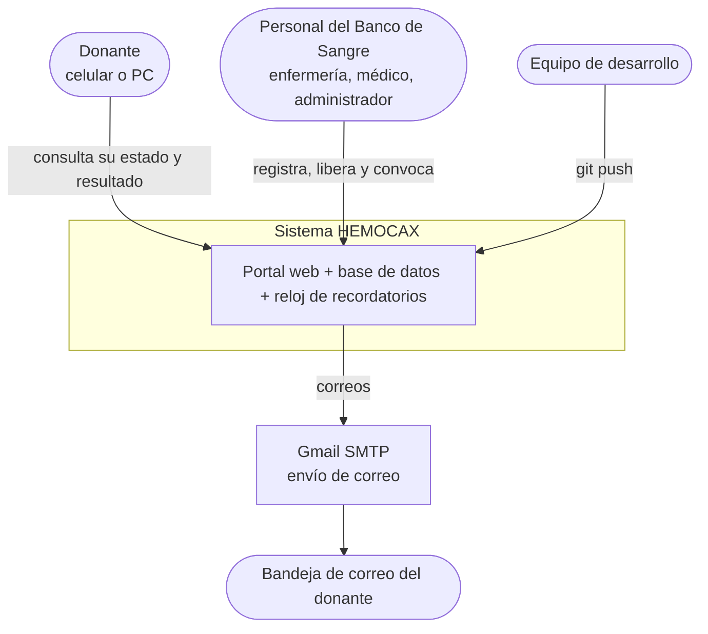

### 6.2 Contenedores y responsabilidades

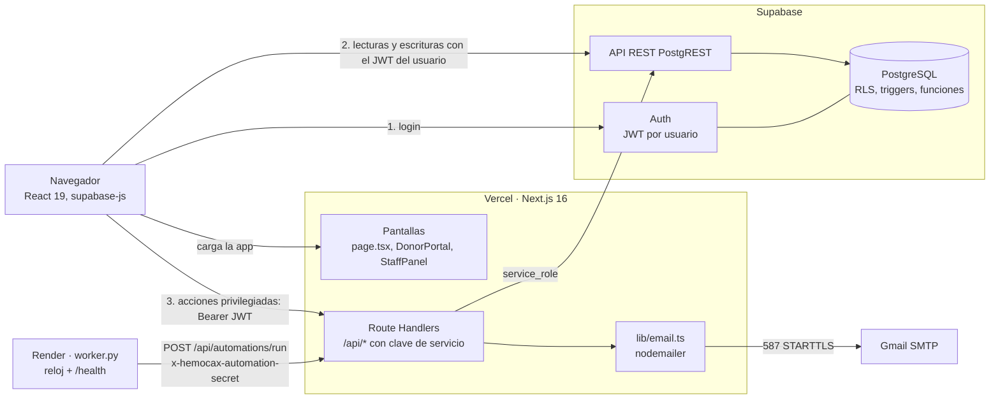

**Regla de oro:** hay dos caminos para tocar datos.

| Camino | Quién lo usa | Qué decide el permiso |
|---|---|---|
| **A. Navegador → Supabase** (clave pública + JWT del usuario) | Casi todo: leer listas, registrar donantes y donaciones, liberar resultados, campañas, parámetros… | **La base de datos** (RLS, `CHECK`, triggers, funciones). La pantalla es solo comodidad. |
| **B. Navegador → ruta `/api` → Supabase con clave de servicio** | Solo lo que ningún usuario común puede hacer: crear usuarios de Auth, enviar correo, anonimizar la cuenta, correr automatizaciones | **La ruta**, que primero valida el JWT y el rol del que llama. |

### 6.3 Despliegue

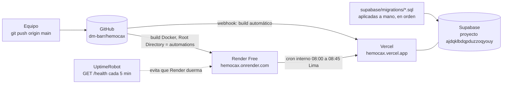

| Servicio | Plan | Qué corre | Secretos que guarda |
|---|---|---|---|
| **Vercel** | Hobby | Next.js (pantallas y `/api/*`) | Claves de Supabase, SMTP, `AUTOMATION_RUN_SECRET`, `AUTOMATION_DRY_RUN` |
| **Supabase** | Free | Auth + PostgreSQL | — |
| **Render** | Free (se duerme a los 15 min) | `automations/worker.py` en Docker | `AUTOMATION_RUN_SECRET`, `HEMOCAX_API_URL`, `AUTOMATIONS_ENABLED` |
| **Gmail** | Cuenta gratuita | SMTP con *contraseña de aplicación* | — (la contraseña vive en Vercel) |

### 6.4 Por qué el reloj está aparte

Vercel no mantiene procesos permanentes, así que no puede “despertar solo a las 8:00”. Render sí, pero su plan gratuito **bloquea SMTP saliente** (error `Network is unreachable` en el puerto 587). Por eso el reparto es:

- **Render**: solo decide *cuándo* (a las 08:00, 08:15, 08:30 y 08:45 llama al portal).
- **Vercel**: decide *a quién* y **envía** los correos.

Consecuencia: si el reloj falla, el portal y los envíos manuales siguen funcionando.

---

## 7. Frontend

### 7.1 Estructura de componentes

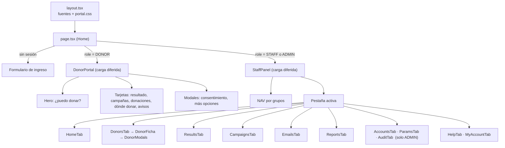

### 7.2 Decisiones de implementación

| Tema | Decisión |
|---|---|
| **Sin enrutador por URL** | Una sola ruta (`/`). El panel del personal navega con estado (`nav.tab` en `StaffPanel`) y se puede “saltar” entre pestañas con `go(tab, intent)`. Es simple y suficiente; el costo es que no hay enlaces directos a una pestaña. |
| **Carga diferida por rol** | `next/dynamic` con `ssr: false`: el donante solo descarga `DonorPortal` (liviano, importante en celulares y redes lentas); el personal, `StaffPanel`. |
| **Datos en el cliente** | Los componentes consultan Supabase directamente con `getBrowserSupabaseClient()` (un único cliente por pestaña, sesión persistida). |
| **Aptitud calculada una sola vez** | `useDirectory()` carga donantes + donaciones + parámetros y llama a `computeEligibility` por donante; las demás pantallas reutilizan ese cálculo. |
| **Mensajes de error en español claro** | `friendlyError()` traduce los mensajes técnicos de PostgreSQL/Supabase (por ejemplo la violación del máximo anual). |
| **Tipografías propias** | `next/font/google` las descarga al compilar y las sirve desde el mismo dominio (sin pedidos externos). |
| **Estilos** | CSS plano: `portal.css` (global y panel) y `donor.css` (portal del donante, diseño propio de 1 columna en celular y 2 en escritorio). Sin librería de componentes. |
| **Accesibilidad básica** | Etiquetas en formularios, `aria-live` en los avisos, `aria-current` en el menú, objetivos táctiles grandes en el portal del donante. |

### 7.3 Patrones que se repiten

- **`Notify`** (`ui.tsx`): función `notify(mensaje, 'ok' | 'error')` que cada pestaña recibe por *props* y que `StaffPanel` muestra como aviso temporal.
- **Modal apilable** (`ui.tsx`): `Modal` mantiene una pila para permitir un modal dentro de otro (ficha → registrar donación).
- **`callApi(path, body)`** (`staff/api.ts`): toma el `access_token` de la sesión y hace `POST` con `Authorization: Bearer …`. Es la única puerta del navegador hacia `/api`.

---

## 8. Autenticación y autorización

### 8.1 Ingreso por DNI

El donante no necesita correo para entrar. Internamente, el DNI se convierte en un correo sintético que solo existe como identificador en Supabase Auth: `dni-<DNI>@login.hemocax.org` (no se envía nada a esa dirección).

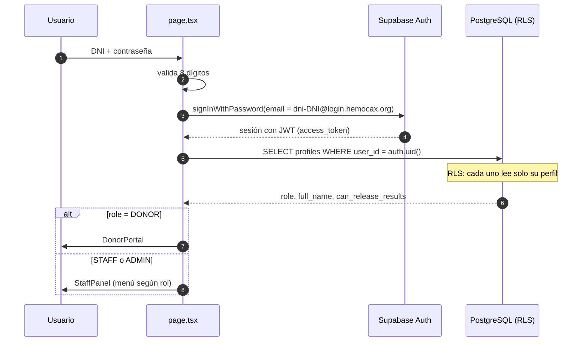

- **Sin auto-registro.** Las cuentas las crea un administrador (ruta `POST /api/admin/users`), que además verifica la identidad.
- **Contraseñas.** Donantes: fáciles de dictar por teléfono (formato `sol-rio-casa47`, generadas en `AccountsTab`). Personal: 14 caracteres aleatorios. Mínimos: 12 caracteres al crear una cuenta y al cambiarla desde *Mi cuenta* (personal); el donante puede cambiar la suya desde su portal con un mínimo de 8.
- **Desactivar una cuenta** aplica un *ban* de 876 000 horas en Auth y `profiles.active = false`; `current_role()` ignora perfiles inactivos.

### 8.2 Cómo se decide cada permiso

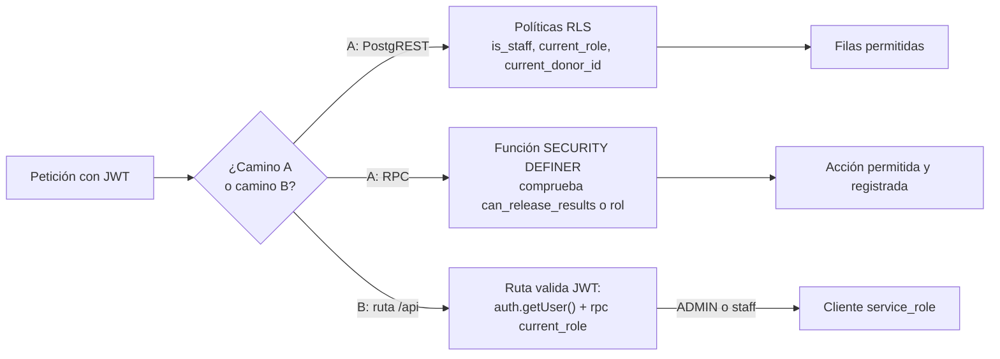

Cómo los verifica cada ruta:

| Ruta | Verificación | Si falla |
|---|---|---|
| `admin/*` | `requireAdmin()`: JWT válido y `rpc('current_role') = 'ADMIN'` | 401 sin token o sesión inválida · 403 si no es admin |
| `communications/send` | JWT válido; el `INSERT` en `communications` se hace **con el cliente del usuario**, por lo que RLS exige `is_staff()` | 401 · error de RLS si no es personal |
| `automations/run` | Cabecera `x-hemocax-automation-secret` igual a `AUTOMATION_RUN_SECRET` | 401 |
| `communications/webhook` *(heredada)* | Cabecera `x-hemocax-webhook-secret` | 401 |

---

## 9. Modelo de datos

### 9.1 Diagrama entidad-relación

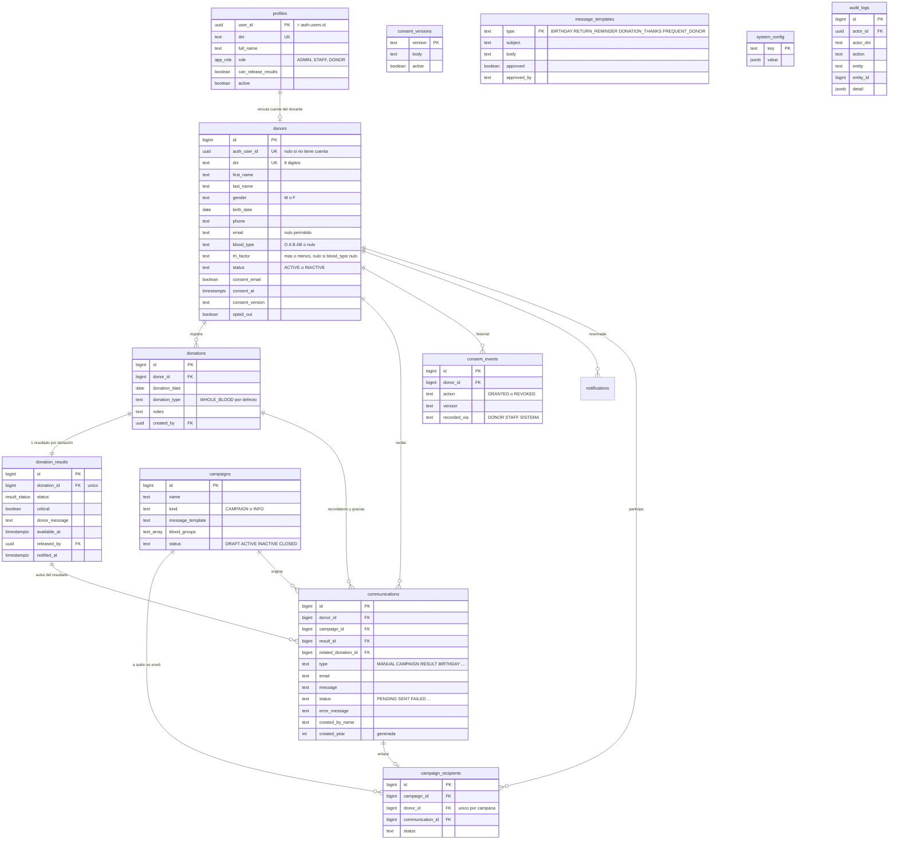

> `profiles.user_id` y `audit_logs.actor_id` apuntan a `auth.users` (esquema de Supabase Auth). `notifications` existe pero hoy no la usa ninguna pantalla.

### 9.2 Restricciones que sostienen las reglas

| Restricción | Efecto |
|---|---|
| `donors.dni ~ '^[0-9]{8}$'` y `UNIQUE` | Un donante por DNI; formato válido. |
| `donors_blood_pair_check`: `(blood_type is null) = (rh_factor is null)` | O hay grupo **y** factor, o ninguno (permite “No sé”). |
| `donors`: `consent_email = false OR (consent_at, consent_version, email) no nulos` | Imposible tener consentimiento sin fecha, versión ni correo. |
| `profiles`: `can_release_results = false OR role IN ('ADMIN','STAFF')` | Un donante jamás puede liberar resultados. |
| `donation_results`: `critical = false OR status IN ('PENDING','CRITICAL_PENDING')` | Un resultado crítico no puede estar liberado. |
| `donation_results`: estados liberados exigen `critical = false` y `available_at` | Un resultado liberado siempre tiene fecha y no es crítico. |
| `donation_results.donation_id UNIQUE` | Exactamente un resultado por donación. |
| `communications.channel = 'EMAIL'`, `donors.preferred_channel = 'EMAIL'` | Canal único (correo). |
| `campaign_recipients UNIQUE (campaign_id, donor_id)` | Nadie recibe dos veces la misma campaña. |

### 9.3 Índices únicos antimultiplicación de correos automáticos

Todos sobre `communications`:

| Índice | Condición | Garantiza |
|---|---|---|
| `birthday_once_per_year_idx (donor_id, created_year, type)` | `type = 'BIRTHDAY'` | 1 cumpleaños por donante y año |
| `frequent_once_per_year_idx (donor_id, created_year, type)` | `type = 'FREQUENT_DONOR'` | 1 reconocimiento por donante y año |
| `donation_thanks_once_idx (related_donation_id, type)` | `type = 'DONATION_THANKS'` | 1 agradecimiento por donación |
| `return_reminder_once_per_donation_idx (related_donation_id, type)` | `type = 'RETURN_REMINDER'` | 1 recordatorio por donación |

`created_year` es una columna **generada** (`extract(year from created_at at time zone 'UTC')`), de modo que el índice funciona sin lógica en la aplicación. Cuando la ruta de automatización intenta insertar un duplicado, la base responde con error `23505` y la ruta simplemente lo omite.

### 9.4 Migraciones

Se aplican **en orden** (SQL Editor de Supabase o `psql "$DATABASE_URL" -f archivo.sql`):

| # | Archivo | Contenido |
|---|---|---|
| 1 | `20260927000100_initial_schema.sql` | Tablas base, funciones auxiliares, RLS, trigger del máximo anual, resultado pendiente automático, `release_noncritical_result` |
| 2 | `20261002000200_pilot_features.sql` | Críticos (`mark/clear`), parámetros, consentimiento versionado y su historial, bitácora por triggers, plantillas aprobables, `created_by_name`, `campaigns.kind`, `anonymize_donor` |
| 3 | `20261003000300_contact_info.sql` | Clave `contact_info` y política de lectura pública de parámetros |

> No hay herramienta de migraciones (Prisma, Flyway…): son scripts SQL ejecutados a mano. Una migración nueva debe llevar el siguiente número en el nombre y **no editar las anteriores** una vez aplicadas en producción.

---

## 10. Lógica dentro de la base de datos

Esta es la parte más importante de la seguridad: **si algo se rompe en la pantalla, la base sigue protegiendo**.

### 10.1 Funciones auxiliares (`SECURITY DEFINER`, `row_security = off`)

| Función | Devuelve |
|---|---|
| `current_role()` | Rol del usuario autenticado (solo si `active`) |
| `current_donor_id()` | `donors.id` cuyo `auth_user_id` es el usuario |
| `is_staff()` | `true` si es `ADMIN` o `STAFF` |
| `can_release_results()` | `true` si es personal activo con el permiso de liberar |

### 10.2 Funciones de negocio (RPC)

| Función | Quién | Qué hace | Falla si |
|---|---|---|---|
| `release_noncritical_result(id, mensaje)` | `can_release_results` | `PENDING → AVAILABLE`, guarda mensaje, `available_at`, `released_by`; escribe en bitácora | no autorizado; resultado crítico, inexistente o ya liberado |
| `mark_result_critical(id)` | personal | `PENDING → CRITICAL_PENDING`, `critical = true`, borra el mensaje | no personal; ya liberado |
| `clear_result_critical(id)` | `can_release_results` | `CRITICAL_PENDING → PENDING`, `critical = false` | no autorizado; no estaba crítico |
| `publish_consent_version(texto)` | `ADMIN` | Crea `vN`, desactiva la anterior, bitácora | no admin; texto < 40 caracteres |
| `anonymize_donor(id)` | `ADMIN` | Sustituye nombre/DNI/teléfono/correo, deja el donante inactivo y sin consentimiento, enmascara sus comunicaciones, borra `notifications`, bitácora | no admin; donante inexistente |

Las RPC están concedidas solo a `authenticated` (`revoke … from public, anon`).

### 10.3 Triggers

| Trigger | Tabla / momento | Función | Qué hace |
|---|---|---|---|
| `donations_annual_limit` | `donations` · BEFORE INSERT | `enforce_annual_donation_limit` | Bloquea la fila del donante (`FOR UPDATE`) y cuenta sus donaciones de sangre total del año; si alcanza 4 (M) o 3 (F) lanza excepción. El bloqueo evita que dos registros simultáneos se salten el máximo. |
| `donation_pending_result` | `donations` · AFTER INSERT | `create_pending_result` | Crea el `donation_results` en `PENDING`. |
| `donors_consent_log` | `donors` · AFTER INSERT/UPDATE | `log_consent_change` | Inserta en `consent_events` (`GRANTED`/`REVOKED`) cuando cambia `consent_email` u `opted_out`; registra quién (`DONOR`, `STAFF` o `SISTEMA`). |
| `donors_audit`, `donations_audit`, `campaigns_audit`, `system_config_audit`, `message_templates_audit` | tablas respectivas · AFTER INSERT/UPDATE/DELETE | `audit_row_change` | Registra acción, entidad, `entity_id`, quién y **solo los nombres de los campos que cambiaron** (nunca los valores). |
| `message_templates_reset` | `message_templates` · BEFORE UPDATE | `reset_template_approval` | Si cambia el asunto o el cuerpo, `approved` vuelve a `false`. |

### 10.4 Matriz de RLS

`—` = sin acceso. “Propio” = filas cuyo `donor_id`/`auth_user_id` es el del usuario.

| Tabla | DONOR | STAFF | ADMIN |
|---|---|---|---|
| `profiles` | lee el suyo | lee el suyo | lee todos |
| `donors` | lee y actualiza **solo** columnas de consentimiento del suyo | lee, crea y edita todos | igual que STAFF |
| `donations` | lee las suyas | lee, crea y edita | igual |
| `donation_results` | lee **solo** las suyas **liberadas y no críticas** | lee todas; cambios **solo vía RPC** | igual |
| `campaigns` | lee las `ACTIVE` | lee y administra | igual |
| `campaign_recipients` | — | todo | todo |
| `communications` | — | todo | todo |
| `notifications` | lee y marca las suyas | lee | lee |
| `consent_versions` | lee | lee | lee; publica por RPC |
| `consent_events` | lee los suyos | lee | lee |
| `message_templates` | — | lee | lee y edita |
| `system_config` | lee solo claves públicas (límites, intervalos, recomendaciones, contacto) | lee todo | lee y escribe |
| `audit_logs` | — | — | lee |

Detalles que importan:

- `donation_results` tiene **`REVOKE UPDATE`** para `authenticated`: ningún usuario puede cambiar un resultado con `UPDATE` directo; solo pasan por las funciones anteriores.
- `donors` tiene `GRANT UPDATE (consent_email, consent_at, consent_version, opted_out, preferred_channel)` para `authenticated`; combinado con la política `donors_update_own_consent`, el donante solo puede tocar esas columnas de su propia fila.
- No existen políticas de `DELETE` para usuarios: borrar datos solo es posible desde el servidor (clave de servicio) o con SQL directo.

---

## 11. Máquinas de estado

### 11.1 Resultado de una donación

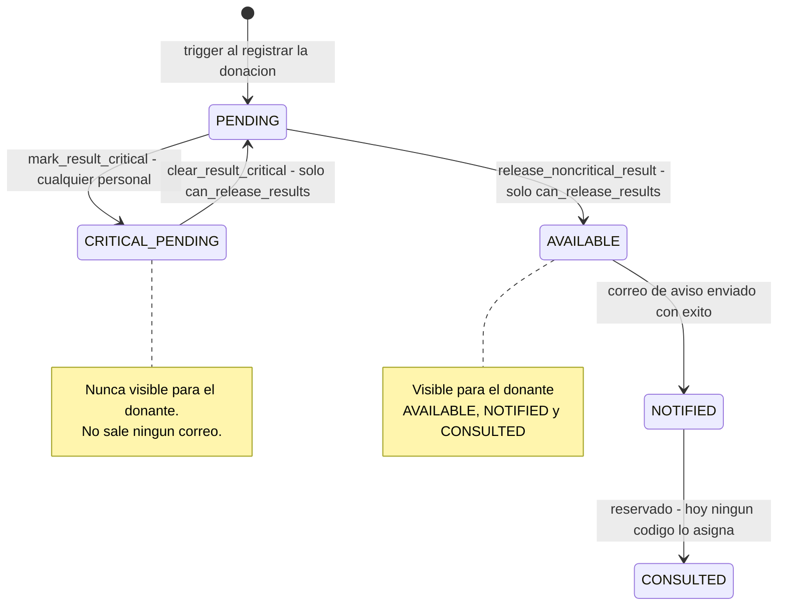

### 11.2 Aptitud del donante (`computeEligibility`)

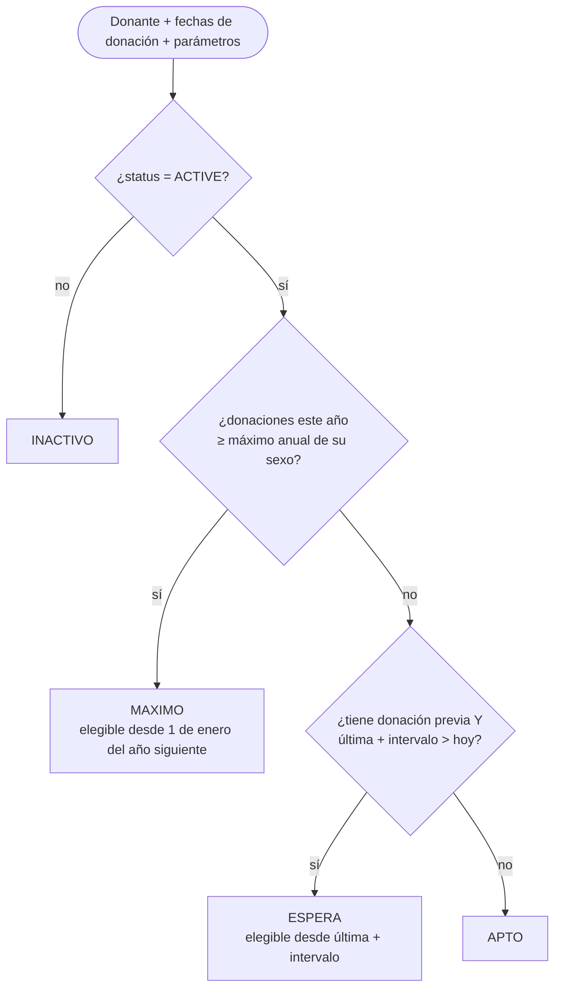

Detalles: “hoy” se calcula en **hora de Lima fija (UTC−5)** con `limaToday()` (Perú no usa horario de verano); solo cuentan donaciones `WHOLE_BLOOD`; el año se toma de la fecha de la donación, no de la de registro.

### 11.3 Comunicación

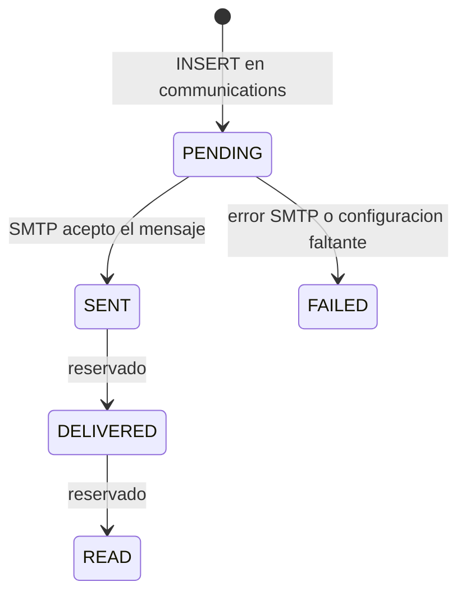

El esquema acepta `QUEUED`, `DELIVERED` y `READ` por compatibilidad con otros canales; con SMTP solo se usan `PENDING`, `SENT` y `FAILED`.

---

## 12. Flujos de extremo a extremo

### 12.1 Registrar una donación

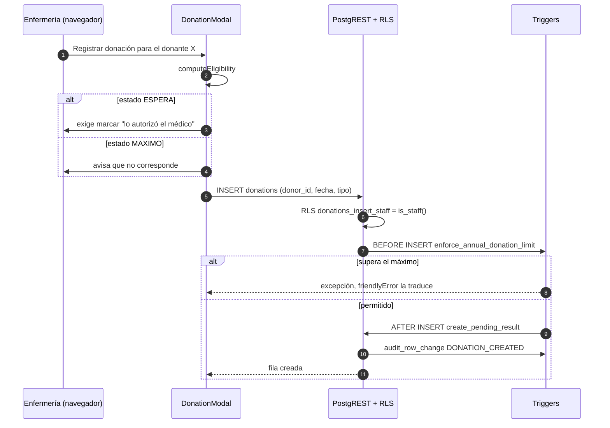

### 12.2 Liberar un resultado y avisar al donante

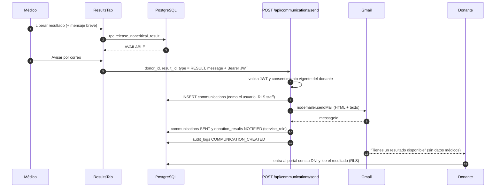

### 12.3 Pipeline de envío de correo

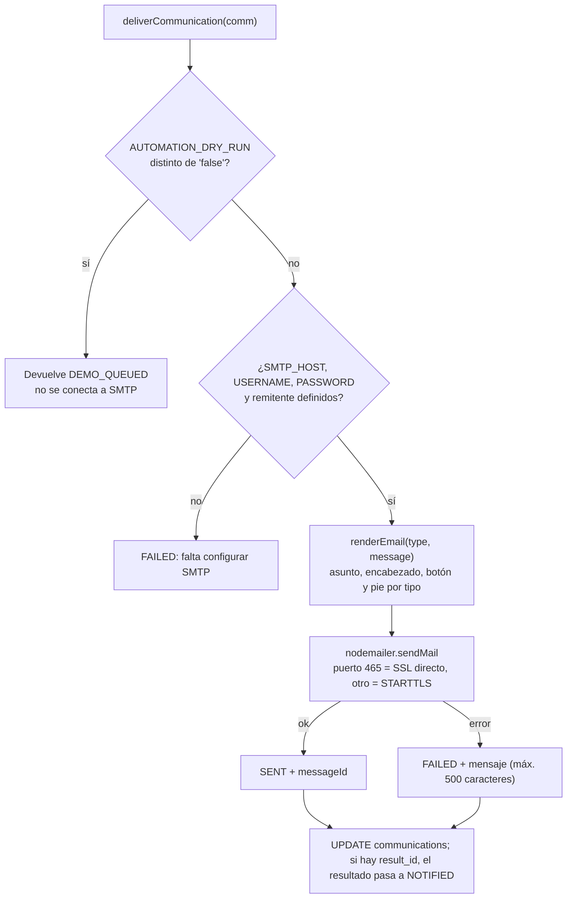

Tipos de correo y su diseño (`lib/emailTemplate.ts`): `BIRTHDAY`, `RETURN_REMINDER`, `DONATION_THANKS`, `FREQUENT_DONOR`, `CAMPAIGN`, `MANUAL`, `RESULT`. Los de `RETURN_REMINDER` y `RESULT` incluyen botón al portal. Todos llevan pie con la forma de dejar de recibir mensajes. El texto del usuario se **escapa** (`escapeHtml`) antes de insertarlo en el HTML; los enlaces se detectan y se convierten en `<a>`.

### 12.4 Automatización diaria

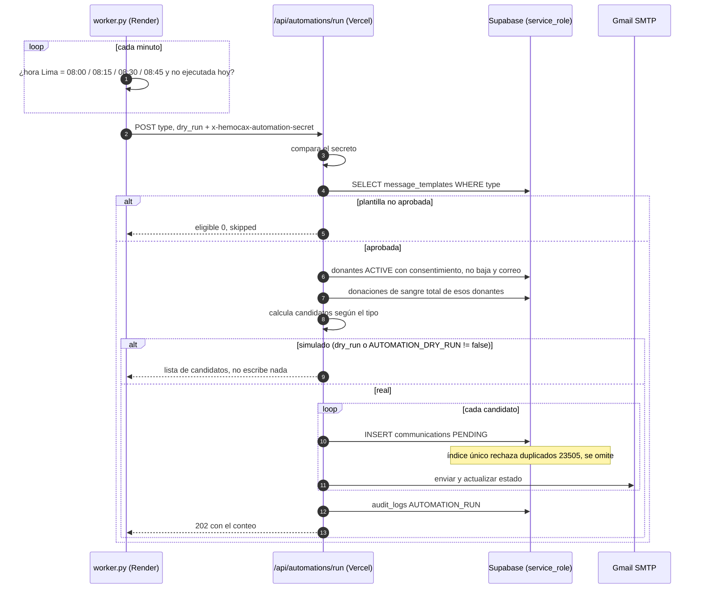

Candidatos por tipo (todos parten de: donante activo, con correo, consentimiento vigente y sin baja):

| Tipo | Condición | Referencia para evitar duplicados |
|---|---|---|
| `BIRTHDAY` | Mes y día de `birth_date` = hoy (Lima) | donante + año |
| `RETURN_REMINDER` | Tiene ≥ 1 donación **y** `computeEligibility = APTO` | última donación |
| `FREQUENT_DONOR` | `computeEligibility = MAXIMO` | donante + año |
| `DONATION_THANKS` | Donación con 0 a 7 días de antigüedad | esa donación |

Detalle de seguridad operativa: en modo simulación **no se insertan filas**, porque una fila simulada ocuparía el índice único del año y bloquearía el envío real.

### 12.5 Campaña dirigida

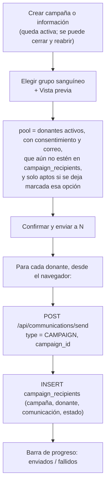

Una campaña de tipo **información** (`kind = 'INFO'`) se publica además en el portal del donante mientras esté `ACTIVE`, y también puede enviarse por correo con el mismo flujo. Solo las campañas `ACTIVE` ofrecen el botón *Enviar por correo*; *Cerrar* y *Reabrir* alternan `ACTIVE` y `CLOSED`.

### 12.6 Importación de donantes

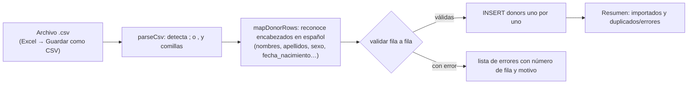

Reglas de validación: DNI 8 dígitos y no repetido; nombre y apellido; sexo `M/F/Hombre/Mujer…`; fecha `AAAA-MM-DD` o `DD/MM/AAAA` (no futura, ≥ 1900); teléfono ≥ 7 dígitos; correo válido (opcional); grupo `O+`, `A-`… o vacío / «No sé». El consentimiento **no** se importa: se registra aparte, con el texto leído al donante.

### 12.7 Derecho de cancelación (anonimizar)

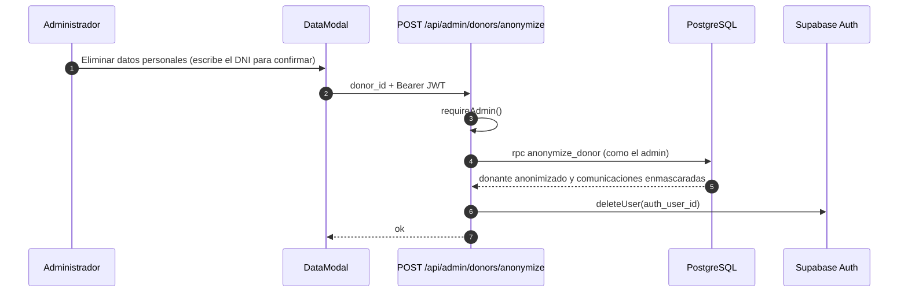

Se conservan las donaciones (cifras sin identificar a la persona); desaparecen nombre, DNI (sustituido por `9XXXXXXX`), teléfono, correo y la cuenta de acceso.

---

## 13. Referencia de la API

Todas las rutas son `POST`, reciben y devuelven JSON y están en `app/api/`. Las que usan sesión esperan `Authorization: Bearer <access_token>` (lo agrega `callApi()`).

### 13.1 `POST /api/admin/users` — crear cuenta *(ADMIN)*

| Campo | Tipo | Notas |
|---|---|---|
| `dni` | string | 8 dígitos |
| `full_name` | string | obligatorio |
| `role` | `'ADMIN' \| 'STAFF' \| 'DONOR'` | |
| `password` | string | mínimo 12 caracteres |
| `can_release_results` | boolean | ignorado si `role = DONOR` |
| `donor_id` | number | obligatorio si `role = DONOR`; vincula `donors.auth_user_id` |

Pasos: crea el usuario en Auth (`email = dni-<DNI>@login.hemocax.org`, confirmado) → inserta `profiles` → si es donante, vincula con `donors` (solo si aún no tenía cuenta) → registra `USER_CREATED`. Si un paso falla, **revierte** los anteriores.

| Código | Cuándo |
|---|---|
| 201 | `{ user_id, dni, full_name, role, can_release_results }` |
| 400 | DNI, nombre, rol, contraseña o `donor_id` inválidos |
| 401 / 403 | sin sesión / no es administrador |
| 409 | el DNI ya tiene cuenta, o el donante ya está vinculado |

### 13.2 `POST /api/admin/users/manage` — gestionar cuentas *(ADMIN)*

| `action` | Campos extra | Resultado |
|---|---|---|
| `reset_password` | `user_id` | Genera 14 caracteres aleatorios, la fija y la devuelve `{ password }` (se muestra una sola vez). Bitácora `USER_PASSWORD_RESET`. |
| `set_active` | `user_id`, `active` | Activa o desactiva (ban en Auth + `profiles.active`). No permite desactivarse a sí mismo ni dejar el sistema sin un ADMIN activo. |
| `set_release` | `user_id`, `value` | Da o quita `can_release_results` (no válido para donantes). |

### 13.3 `POST /api/admin/donors/anonymize` — anonimizar *(ADMIN)*

Cuerpo `{ donor_id }`. Ejecuta `rpc('anonymize_donor')` con el cliente del administrador y luego elimina la cuenta de Auth del donante. Respuestas: `200 { ok: true }`, `400`, `404` (donante no existe), `500`.

### 13.4 `POST /api/communications/send` — enviar un correo *(personal)*

| Campo | Notas |
|---|---|
| `donor_id` | obligatorio |
| `message` | obligatorio; admite `{{nombre}}` ya resuelto por el cliente |
| `type` | `MANUAL` (por defecto), `CAMPAIGN`, `RESULT` |
| `result_id` | opcional; si se envía, el resultado pasa a `NOTIFIED` cuando el correo sale |
| `campaign_id` | opcional |

Rechaza con **403** si el donante no está activo, no tiene consentimiento vigente, está dado de baja o no tiene correo. Responde `201` con la comunicación y su estado final (`SENT` o `FAILED` + `error_message`).

### 13.5 `POST /api/automations/run` — ejecutar automatización *(secreto)*

Cabecera `x-hemocax-automation-secret`. Cuerpo `{ type, dry_run? }` con `type ∈ BIRTHDAY, RETURN_REMINDER, FREQUENT_DONOR, DONATION_THANKS`.

| Respuesta | Significado |
|---|---|
| `401` | secreto incorrecto o no configurado |
| `400` | tipo no válido |
| `200 { eligible: 0, skipped }` | plantilla no aprobada |
| `200 { eligible, donors }` | simulación (no escribió nada) |
| `202 { count, communications }` | envío real realizado |

`maxDuration = 60` s por llamada (envío secuencial: ver [19.3](#193-deuda-técnica-y-comportamientos-conocidos)).

### 13.6 `POST /api/communications/webhook` *(heredada)*

Callback que usaba `worker.py` cuando enviaba los correos él mismo. Ya no forma parte del flujo en producción; se mantiene por compatibilidad. Autenticación: `x-hemocax-webhook-secret`.

### 13.7 `GET /health` del worker (Render)

`{ ok: true, enabled, dry_run }`. Lo consulta Render como *health check* y UptimeRobot para evitar que el servicio se duerma.

---

## 14. Configuración

### 14.1 Variables de entorno

`.env.example` es la plantilla. En local se usa `.env` (ignorado por git); en producción, el panel de cada servicio.

| Variable | Dónde | Obligatoria | Para qué |
|---|---|---|---|
| `NEXT_PUBLIC_SUPABASE_URL` | Vercel, local | sí | URL del proyecto Supabase (pública) |
| `NEXT_PUBLIC_SUPABASE_ANON_KEY` | Vercel, local | sí | Clave pública (`sb_publishable_…`) |
| `SUPABASE_SERVICE_ROLE_KEY` | Vercel (solo servidor), local | sí | Clave de servicio (`sb_secret_…`). **Nunca** en el navegador ni en git |
| `DATABASE_URL` | solo tu equipo | no | Para aplicar migraciones con `psql` |
| `SMTP_HOST`, `SMTP_PORT`, `SMTP_USERNAME`, `SMTP_PASSWORD`, `SMTP_USE_TLS` | Vercel | para enviar | Servidor de correo (`smtp.gmail.com`, `587`, contraseña de aplicación) |
| `EMAIL_FROM_ADDRESS`, `EMAIL_FROM_NAME` | Vercel | recomendada | Remitente |
| `AUTOMATION_DRY_RUN` | Vercel y Render | sí | `false` = envía de verdad; **cualquier otro valor simula** |
| `AUTOMATION_RUN_SECRET` | Vercel **y** Render (mismo valor) | sí | Autentica al reloj ante el portal |
| `AUTOMATIONS_ENABLED` | Render | sí | `true` enciende el reloj |
| `AUTOMATION_TIMEZONE` | Render | no | Por defecto `America/Lima` |
| `HEMOCAX_API_URL` | Render | sí | URL del portal (`https://hemocax.vercel.app`) |
| `NEXT_PUBLIC_SITE_URL` | Vercel | no | URL usada en los botones de los correos (si falta, se deduce de Vercel) |
| `AUTOMATION_WEBHOOK_SECRET`, `AUTOMATION_HOST`, `PORT` | Render | no | Solo para el camino heredado del webhook / servidor HTTP |

> **Seguridad del interruptor de envío.** El valor por omisión es **simular**. Para que salgan correos reales hay que poner `AUTOMATION_DRY_RUN=false` explícitamente. Así un despliegue mal configurado nunca envía correos por accidente.

### 14.2 Parámetros del sistema (`system_config`)

Editables por el administrador en *Parámetros*; los lee `loadParams()` (con valores por defecto si faltan o no son válidos).

| Clave | Por defecto | Uso | ¿Visible al donante? |
|---|---|---|---|
| `male_annual_limit` / `female_annual_limit` | 4 / 3 | Aptitud en pantalla (el trigger SQL **no** los lee, ver 19.3) | sí |
| `male_interval_days` / `female_interval_days` | 90 | Intervalo mínimo entre donaciones (provisional) | sí |
| `donation_interval_days` | 90 | Valor base si faltan los de arriba | sí |
| `result_recommendations` | texto | Recomendaciones junto al resultado | sí |
| `contact_info` | texto | “Dónde y cuándo donar” | sí |
| `recognition_at_annual_limit` | `true` | Reservada | no |

### 14.3 Plantillas automáticas (`message_templates`)

Cuatro filas: `BIRTHDAY`, `RETURN_REMINDER`, `DONATION_THANKS`, `FREQUENT_DONOR`. Variable disponible: `{{nombre}}`. Nacen **sin aprobar**; el administrador las aprueba en *Parámetros* y queda `approved_by` y `approved_at`. Cualquier edición del asunto o del texto las desaprueba.

---

## 15. Despliegue y operación

### 15.1 Puesta en marcha desde cero

1. **Supabase:** crear el proyecto; copiar URL, clave pública y clave de servicio.
2. **Migraciones:** aplicar los tres archivos de `supabase/migrations/` en orden.
3. **Primer administrador (una sola vez, a mano):** crear el usuario en Auth con `dni-<DNI>@login.hemocax.org`, y una fila en `profiles` con `role = 'ADMIN'`. Desde ahí todo lo demás se hace en la pantalla *Cuentas de acceso*.
4. **Correo:** activar verificación en dos pasos en la cuenta Gmail y crear una *contraseña de aplicación*.
5. **Vercel:** importar el repositorio; cargar variables; dejar `AUTOMATION_DRY_RUN` distinto de `false` al principio.
6. **Render (opcional, solo para recordatorios):** servicio *Web Service* con Docker, *Root Directory* `automations`, *Health Check Path* `/health`; variables de la tabla anterior.
7. **Activación segura:** aprobar las cuatro plantillas en *Parámetros*; probar en simulación (`/health` debe mostrar `enabled: true`); recién entonces `AUTOMATION_DRY_RUN=false`.

### 15.2 Lista de verificación después de un despliegue

| Comprobación | Cómo |
|---|---|
| El portal carga | abrir `https://hemocax.vercel.app` |
| Reloj vivo | `GET https://hemocax.onrender.com/health` → `{"ok":true,"enabled":true,"dry_run":false}` |
| Automatización protegida | `POST /api/automations/run` sin secreto → `401` |
| Plantillas | si no están aprobadas, la respuesta incluye “plantilla no aprobada” |
| Correo | enviar un correo manual a un donante con consentimiento y revisar su bandeja |

### 15.3 Operación diaria

| Tarea | Dónde |
|---|---|
| Ver si salieron o fallaron los correos | *Correos enviados* (estado y motivo) |
| Ver qué hizo cada persona | *Actividad* (solo administrador) |
| Reinicio de contraseña de un usuario | *Cuentas de acceso* → *Nueva contraseña* |
| Pausar los envíos automáticos | `AUTOMATIONS_ENABLED=false` en Render, o desaprobar las plantillas |
| Pasar a simulación inmediatamente | `AUTOMATION_DRY_RUN` ≠ `false` en Vercel |
| Copias de seguridad | las gestiona Supabase; para exportar, usar las descargas CSV de *Reportes* o `pg_dump` con `DATABASE_URL` |

---

## 16. Guía de desarrollo

### 16.1 Puesta en marcha local

Requisitos: Node.js ≥ 20.9, un proyecto Supabase de pruebas y (para enviar correos) una contraseña de aplicación de Gmail.

```bash
npm install
cp .env.example .env       # completa las variables (ver sección 14)
npm run dev                 # http://localhost:3000
```

| Comando | Qué hace |
|---|---|
| `npm run dev` | Servidor de desarrollo (Turbopack) |
| `npm run build` | Compilación de producción **y comprobación de tipos** (úsalo antes de cada `git push`) |
| `npm start` | Sirve la compilación |
| `python automations/worker.py --once BIRTHDAY` | Ejecuta una automatización a mano contra el portal local (respeta `AUTOMATION_DRY_RUN`) |

> Este proyecto usa **Next.js 16**, con cambios respecto a versiones anteriores. Antes de tocar convenciones del framework, consulta la documentación incluida en `node_modules/next/dist/docs/` (ver `AGENTS.md`).

### 16.2 Convenciones del código

- **TypeScript estricto**; tipos de filas definidos junto a cada pantalla.
- **Una pestaña = un archivo** en `app/staff/`; recibe `notify` y lo que necesite por *props*.
- **Lógica compartida en `lib/`**, nunca duplicada: la aptitud (`eligibility.ts`) es la única fuente de verdad.
- **Autorización en la base**, no en la pantalla. Ocultar un botón es comodidad; la protección real es RLS o una función SQL.
- **Rutas `/api`:** primero validar sesión/rol (o secreto), luego validar el cuerpo, luego operar; devolver `{ error }` con el código correcto.
- **Textos al usuario en español claro**, sin jerga técnica (usar `friendlyError`).
- **Fechas:** guardar como `date`/`timestamptz`; calcular “hoy” con `limaToday()`.
- **Secretos:** nunca en el código ni en el repositorio; `.env` está en `.gitignore`.

### 16.3 Recetas: cómo añadir…

**Una pestaña nueva del personal**
1. Crear `app/staff/MiTab.tsx` (`'use client'`, recibe `{ notify }`).
2. Añadir su clave a `TabKey` en `ui.tsx`.
3. Añadirla a `NAV` y al bloque de pestañas de `StaffPanel.tsx` (con `isAdmin &&` si es solo para administradores).
4. Si lee/escribe una tabla nueva, **crear antes la política RLS** (ver abajo).

**Una tabla o columna nueva**
1. Crear `supabase/migrations/<AAAAMMDDNNNN>_nombre.sql` (nunca editar migraciones ya aplicadas).
2. `enable row level security` y políticas para cada rol; `GRANT`/`REVOKE` de columnas si hace falta.
3. Si debe quedar en la bitácora: `create trigger … execute function public.audit_row_change('NOMBRE','entidad')`.
4. Aplicarla a Supabase y probar con sesiones de cada rol (ver 16.4).

**Un parámetro editable**
1. `insert into system_config` en una migración.
2. Si el donante debe leerlo, añadir la clave a la política `config_read_public_keys`.
3. Leerlo en `lib/params.ts` (`loadParams`) y exponerlo en el tipo `Params`.
4. Añadir el campo en `ParamsTab.tsx`.

**Un tipo de mensaje automático nuevo**
1. Ampliar el `CHECK` de `message_templates.type` y sembrar su plantilla (sin aprobar) en una migración.
2. `app/api/automations/run/route.ts`: añadir el tipo a `TYPES` y su regla de candidatos; si debe enviarse una sola vez, crear el **índice único** correspondiente en `communications`.
3. `automations/worker.py`: añadir la hora en `SCHEDULE`.
4. `lib/emailTemplate.ts`: añadir su encabezado en `CONFIG`.
5. `ui.tsx`: etiqueta en `EMAIL_TYPE_LABEL`.

**Una ruta de servidor nueva**
Copiar el patrón de `admin/users/manage/route.ts` (usa `requireAdmin`) o de `communications/send/route.ts` (personal). Llamarla desde el navegador **siempre con `callApi()`**.

**Un estado o rol nuevo:** cambiar el `enum`/`CHECK` en una migración, actualizar los tipos de TypeScript, `roleTitle()` y las políticas RLS que mencionen el rol.

### 16.4 Cómo verificar (no hay pruebas automáticas)

| Qué | Cómo |
|---|---|
| Compila y los tipos están bien | `npm run build` |
| Un permiso en la base | Iniciar sesión con la API (`signInWithPassword`) como cada rol con un script y probar `select`/`update`; esperado: el donante **no** ve críticos, plantillas ni bitácora |
| Flujo completo | Cargar datos de demostración (`node demo/seed-demo.js`) y recorrer el guion; después `node demo/limpiar-demo.js` |
| Envío de correo sin riesgo | Con `AUTOMATION_DRY_RUN` ≠ `false` solo simula; para probar de verdad usar un donante propio con `correo+alias@gmail.com` |
| Automatizaciones | `dry_run: true` devuelve a quién escribiría sin registrar nada |

Fragmento para probar RLS como donante (Node 20+, con `.env` cargado):

```js
const { createClient } = require('@supabase/supabase-js');
const c = createClient(process.env.NEXT_PUBLIC_SUPABASE_URL, process.env.NEXT_PUBLIC_SUPABASE_ANON_KEY);
await c.auth.signInWithPassword({ email: 'dni-12345678@login.hemocax.org', password: '…' });
console.log((await c.from('audit_logs').select('id')).data);          // []  (sin acceso)
console.log((await c.from('message_templates').select('type')).data);  // []
console.log((await c.from('donation_results').select('id,critical')).data); // solo los suyos, liberados
```

### 16.5 Git y despliegue

- Rama única `main`; cada `git push` despliega en Vercel (y reconstruye Render si cambió `automations/`).
- Antes de subir: `npm run build`.
- **Nunca** subir `.env`, claves ni contraseñas. `demo/CREDENCIALES_DEMO.txt` también está ignorado.
- Los mensajes de commit describen el cambio; no llevan datos personales.

---

## 17. Solución de problemas

| Síntoma | Causa probable | Qué hacer |
|---|---|---|
| “El DNI o la contraseña no son correctos” con credenciales correctas | Cuenta desactivada, o el usuario existe en Auth pero no en `profiles` | Revisar *Cuentas de acceso* o la fila en `profiles` |
| Tras ingresar: “No pudimos abrir tu cuenta” | No existe la fila de `profiles` para ese usuario | Crearla (o recrear la cuenta desde *Cuentas de acceso*) |
| `permission denied` / lista vacía donde debería haber datos | Falta una política RLS o la sesión no tiene el rol esperado | Revisar la política de esa tabla y `select current_role()` con esa sesión |
| “Se alcanzó el máximo anual…” al registrar una donación | Trigger del máximo (4 H / 3 M por año calendario de la **fecha de la donación**) | Es correcto; revisar la fecha ingresada |
| Los correos no salen y el estado queda en `PENDING` | `AUTOMATION_DRY_RUN` ≠ `false` (modo simulación) | Poner `false` en Vercel y redeplegar |
| Correo en `FAILED` con error de autenticación | Contraseña de aplicación inválida o sin verificación en dos pasos | Generar una nueva y actualizar `SMTP_PASSWORD` |
| Correo en `FAILED` con “Network is unreachable” | Se está enviando **desde Render Free** (puerto 587 bloqueado) | El envío debe salir de Vercel, no del worker |
| Automatización responde “plantilla no aprobada” | Las plantillas siguen sin aprobar | *Parámetros* → aprobar mensaje |
| Automatización responde `401` | `AUTOMATION_RUN_SECRET` distinto entre Render y Vercel | Igualar el valor en ambos |
| Render deja de ejecutar a las 08:00 | El servicio gratuito se durmió | Configurar UptimeRobot a `/health` cada 5 min |
| Correo manual con consentimiento falla con 403 | Donante inactivo, con baja, sin correo o sin consentimiento vigente | Revisar la ficha del donante |
| `DNI ya registrado` al crear un donante o cuenta | DNI duplicado (`UNIQUE`) | Buscar al donante existente |
| La importación rechaza filas | Formato (DNI de 8 números, fecha, sexo) | Leer el motivo por fila en la pantalla de importación |
| Listas incompletas con muchos donantes | Supabase devuelve máx. 1000 filas por consulta | Paginar en servidor (ver trabajo futuro) |
| Build falla por tipos | Cambio de columnas sin actualizar tipos | Ajustar los tipos del archivo indicado y repetir `npm run build` |

---

## 18. Seguridad y protección de datos

HEMOCAX trata **datos de salud**, que la Ley N.° 29733 (y su reglamento, D.S. 016-2024-JUS) clasifica como sensibles.

### 18.1 Medidas

| Medida | Cómo se aplica |
|---|---|
| **Seguridad en la base, no solo en la pantalla** | Todas las tablas tienen **RLS**. El donante solo lee sus filas; el personal, lo que su rol permite. Las funciones sensibles comprueban el rol por dentro. |
| **Mínimo privilegio** | La clave de servicio vive solo en el servidor (variables de Vercel). El navegador solo tiene la clave pública. |
| **Sin auto-registro** | Las cuentas las crea un administrador tras verificar la identidad. |
| **Consentimiento expreso e informado** | Texto versionado; se guarda versión, quién registró y cuándo; revocable. Historial en `consent_events`. |
| **Resultados críticos protegidos en tres capas** | (1) La pantalla no los ofrece; (2) la función de liberación los rechaza; (3) la política RLS impide que el donante los lea aunque los pida directamente. |
| **Bitácora automática** | *Triggers* registran altas, ediciones y bajas. Guardan solo **nombres de campos**, no valores (minimización). |
| **Derechos ARCO** | Acceso (descarga JSON), rectificación (editar), oposición (baja de avisos) y cancelación (anonimizar). |
| **Mensajes sin datos médicos** | Los correos solo avisan; el contenido está en el portal, tras iniciar sesión. |
| **Salida de correo escapada** | El texto se escapa antes de entrar al HTML del correo (evita inyección de HTML). |
| **Secretos fuera del código** | `.env` ignorado por git; en producción, variables del servicio. El reloj se autentica con un secreto compartido. |
| **Cabecera `x-powered-by` desactivada** | `next.config.ts` (`poweredByHeader: false`). |

### 18.2 Modelo de amenazas (resumen)

| Amenaza | Mitigación | Riesgo residual |
|---|---|---|
| Un donante intenta ver datos de otro | RLS por `current_donor_id()` | Bajo |
| Un donante intenta leer su resultado crítico | Política RLS + `REVOKE UPDATE` + estados exclusivos | Bajo |
| Personal sin permiso intenta liberar | `can_release_results()` dentro de la función SQL | Bajo |
| Alguien llama a las rutas `/api` sin sesión | `bearerToken` + `getUser()` + rol; `401/403` | Bajo |
| Alguien dispara automatizaciones | Secreto compartido; plantillas deben estar aprobadas; modo simulación por defecto | Bajo (si el secreto se filtra, rotarlo en ambos servicios) |
| Fuga de claves | `.gitignore`; secretos solo en paneles de servicio | **Medio:** las claves usadas en el desarrollo pasaron por canales de chat; se recomienda **rotarlas** (clave de servicio, contraseña de base de datos, contraseña de aplicación de Gmail) antes de producción real |
| Envío de correos a quien no consintió | Doble control: la ruta y la consulta de candidatos filtran por consentimiento | Bajo |
| Suplantación por contraseña débil | Contraseñas generadas; sin recuperación autónoma (la restablece un admin) | Medio: son fáciles de dictar por diseño (donantes) |
| Volumen de datos del piloto | Datos reales de donantes; deben tratarse conforme a la ley | Requiere acuerdos y revisión legal del hospital |

---

## 19. Decisiones, límites y deuda técnica

### 19.1 Decisiones de diseño (y alternativas descartadas)

| Decisión | Motivo | Alternativa descartada |
|---|---|---|
| **Correo en lugar de WhatsApp/SMS** | WhatsApp exige cuenta empresarial y plantillas aprobadas por Meta (costo y trámite); el correo es gratuito e inmediato. | WhatsApp Cloud API (propuesto en el documento original). El **SMS** queda como evolución natural. |
| **Seguridad en PostgreSQL (RLS)** | Los permisos viven en un solo lugar y no se saltan manipulando el navegador. | Servidor propio que decida cada permiso: más código, más superficie de error. |
| **El portal envía los correos y el worker es solo reloj** | Render Free bloquea SMTP; Vercel sí lo permite. | Que el worker envíe (como en la primera versión): fallaba con `Network is unreachable`. |
| **Ingreso por DNI con correo sintético** | Muchos donantes no tienen correo. | Login con correo real: excluiría a parte de los donantes. |
| **Aptitud en un módulo compartido** | Lista, ficha, portal y recordatorios dicen lo mismo. | Calcular en cada pantalla: riesgo de inconsistencias. |
| **Mensajes automáticos con aprobación** | El documento exige que la Jefatura valide los textos. | Textos fijos en el código. |
| **Resultados críticos fuera del canal digital** | Límite expreso del documento. | — |
| **Cálculo de listas y reportes en el navegador** | Simple y suficiente para el piloto. | Vistas/RPC en SQL con paginación (necesario a mayor escala). |
| **Sin enrutador por URL en el panel** | Una sola ruta; menos código. | Rutas por pestaña (enlaces directos, historial del navegador). |
| **Migraciones SQL manuales** | Pocas, controladas, sin herramienta extra. | Supabase CLI / Prisma Migrate. |

### 19.2 Límites funcionales

- **Solo correo.** Un donante sin correo o sin internet no recibe avisos (el portal se lo indica; el personal puede llamarlo).
- **Valores clínicos provisionales:** intervalo de 90 días y máximos 4/3 deben confirmarlos el médico del servicio.
- **Textos pendientes de validación** por la Jefatura: consentimiento, recomendaciones y mensajes automáticos.
- **Gmail** limita el envío diario (cientos por día): suficiente para el piloto, no para campañas masivas.
- Las campañas **no se pueden programar** para una fecha futura.
- **Sin recuperación de contraseña autónoma**: la restablece un administrador.
- Faltan los entregables institucionales: manuales, capacitación, acuerdos de confidencialidad, subdominio y remitente institucionales.
- **Fuera de alcance (declarado en el documento):** reemplazar el sistema actual del Banco de Sangre, comunicar resultados críticos por vía digital, intervenir en procesos asistenciales, trabajar con datos de pacientes receptores, migrar masivamente el histórico del hospital.

### 19.3 Deuda técnica y comportamientos conocidos

| # | Hallazgo | Impacto | Propuesta |
|---|---|---|---|
| 1 | **Máximo anual fijo en el trigger.** `enforce_annual_donation_limit` usa 4 y 3 escritos en SQL; *Parámetros* edita `*_annual_limit`, que solo afecta a la pantalla. | Si se cambian los valores, la pantalla y la base discreparían. | Nueva migración que lea `system_config` dentro del trigger. |
| 2 | **Modo simulación en envíos manuales.** `sendEmail` devuelve `DEMO_QUEUED`, que no es un estado permitido por el `CHECK` de `communications.status`; el `UPDATE` se rechaza y la fila queda `PENDING`. | En simulación, un correo manual queda “pendiente”. No afecta al modo real. | Añadir `DEMO_QUEUED` al `CHECK` o no actualizar en simulación. |
| 3 | **Envío secuencial.** `automations/run` y las campañas envían uno por uno (60 s de límite por llamada en `run`). | Con muchos destinatarios una ejecución podría cortarse; se reintenta al día siguiente y los índices únicos evitan duplicados. | Cola de envío o lotes. |
| 4 | **Cálculos en el navegador y límite de 1000 filas** de Supabase por consulta (los reportes piden hasta 5000 y 10 000). | Padrones grandes pueden verse incompletos. | Paginación y vistas SQL. |
| 5 | **Estado `CONSULTED`** definido pero no asignado por ningún código. | Ninguno visible. | Marcar al abrir el resultado en el portal (requeriría una función SQL). |
| 6 | **Camino heredado:** `communications/webhook` y el endpoint `/email` de `worker.py`. | Código sin uso en producción. | Eliminar cuando se confirme que no se necesita. |
| 7 | **Histórico en el repositorio:** `server.js`, `public/`, `data/`, `n8n/`, `db/`, `docker-compose.yml`. | Confunde; no es parte del sistema. | Mover a una rama de archivo. |
| 8 | **Sin pruebas automáticas.** Verificación manual y de compilación, incluidas pruebas de seguridad con cuentas de cada rol. | Riesgo de regresiones. | Pruebas de RLS y de `lib/*` (por ejemplo con Vitest + una base de pruebas). |
| 9 | **`notifications`** reservada y sin uso. | Ninguno. | Usarla para avisos dentro del portal o eliminarla. |
| 10 | **Reloj en plan gratuito** puede dormirse si falla el monitor. | Se pierde un día de recordatorios. | Plan de pago o un cron externo (por ejemplo GitHub Actions o Vercel Cron). |

### 19.4 Trabajo futuro

Canal SMS (zonas sin internet), recuperación de contraseña autónoma, campañas programadas, integración de solo lectura con el sistema del hospital, pruebas automáticas, paginación en el servidor, cola de envíos y rotación periódica de secretos.

---

# Parte III · Sustentación

## 20. Preguntas probables en la sustentación

### Producto y alcance

**¿Por qué correo y no WhatsApp, como decía el documento?**
WhatsApp requiere cuenta empresarial, número institucional y plantillas aprobadas por Meta, con costo recurrente. El correo es gratuito, inmediato y suficiente para validar el piloto. Se reconoce la limitación para zonas rurales y se propone SMS como siguiente paso.

**¿Reemplaza al sistema del hospital?**
No. Es complementario, con base de datos propia, y no toca el sistema en producción ni los procesos asistenciales. Solo maneja datos de **donantes**.

**¿Qué pasa si el donante no tiene internet o correo?**
Hoy no recibe avisos digitales, pero el personal puede contactarlo por teléfono con los datos del padrón. Por eso SMS es el principal trabajo futuro.

**¿Cuáles son los indicadores de éxito?**
Los de la sección 10 del documento, que *Reportes* ya calcula: tasa de donantes que vuelven, tiempo de entrega de resultados (meta 48 h), donantes O negativo con consentimiento y mensajes emitidos con su bitácora. La línea base se fija con los datos del hospital.

**¿Cuánto cuesta operarlo?**
En el piloto, nada: Vercel, Supabase, Render y Gmail en planes gratuitos. A mayor escala convendría pagar el reloj y un servicio de correo transaccional o SMS; esa decisión corresponde a la Dirección.

### Seguridad y privacidad

**¿Cómo se garantiza que un resultado crítico nunca llegue por el portal o el correo?**
En tres capas: la interfaz no ofrece liberarlo, la función de liberación de la base lo rechaza, y una política de seguridad (RLS) impide que el donante lo lea aunque lo pida directamente. Además se verificó con una sesión de donante.

**¿Qué pasa si alguien manipula el navegador?**
Nada: los permisos no dependen de la pantalla sino de la base de datos. La clave de servicio nunca llega al navegador.

**¿Cómo se protege la privacidad?**
Consentimiento expreso, informado y revocable; acceso por rol; bitácora de auditoría (solo nombres de campos); mensajes sin datos médicos; derechos de acceso, rectificación, oposición y cancelación.

**¿Quién es el titular de los datos?**
El hospital. El equipo ejecutor actúa como encargado del tratamiento y firmará acuerdos de confidencialidad (compromiso del documento).

**¿Por qué el donante entra con DNI y no con correo?**
Porque muchos no tienen correo. El sistema usa un identificador interno derivado del DNI, y las cuentas las crea el personal tras verificar la identidad.

### Técnicas

**¿Por qué Supabase/PostgreSQL con RLS en lugar de un backend propio?**
Porque los permisos se declaran una sola vez y los hace cumplir el motor de la base, incluso si el código de la aplicación tiene un error. Reduce código y superficie de ataque.

**¿Cómo evita enviar el mismo correo dos veces?**
Con índices únicos en la base (por año o por donación): si el reloj corre dos veces, el segundo intento falla con `23505` y se omite.

**¿Y si el reloj automático falla?**
El portal y los envíos manuales siguen funcionando; solo dejan de salir los recordatorios programados. El reloj se vigila con un monitor externo.

**¿Por qué el reloj está en Python y en otro servicio?**
Vercel no mantiene procesos permanentes. Render sí, pero bloquea el SMTP en el plan gratuito; por eso el reloj solo *dispara* y el portal *envía*.

**¿Cómo se evita que dos personas registren la última donación permitida a la vez?**
El trigger bloquea la fila del donante (`FOR UPDATE`) antes de contar; el segundo registro espera y ve el conteo actualizado.

**¿Cómo se midió que funciona?**
Compilación sin errores de tipos y pruebas manuales de punta a punta (registro, donación, liberación, correo real, portal del donante, cuentas, importación, anonimización), más pruebas de seguridad con cuentas de cada rol. No hay aún pruebas automatizadas y se declara como limitación (sección 19.3).

**¿Qué limitaciones técnicas reconocen?**
Las de la [sección 19.3](#193-deuda-técnica-y-comportamientos-conocidos): máximo anual duplicado entre pantalla y trigger, envío secuencial, cálculos en el navegador con padrones grandes, reloj en plan gratuito y ausencia de pruebas automáticas.

---

## 21. Demostración y video

La carpeta `demo/` contiene todo lo necesario para grabar una demostración reproducible **sin tocar los datos reales**:

| Archivo | Uso |
|---|---|
| `demo/seed-demo.js` | Crea cuentas y donantes de demostración (DNI `9900…`), resultados, campañas e historial de correos |
| `demo/limpiar-demo.js` | Borra todo lo creado, incluidas las huellas en la bitácora |
| `demo/GUION_VIDEO.md` | Guion escena por escena (máx. 20 min), con las pantallas que conviene evitar |
| `demo/donantes_demo.csv` | Archivo de ejemplo para la escena de importación (5 filas válidas y 2 con error) |
| `demo/CREDENCIALES_DEMO.txt` | Cuentas y contraseñas de la demo (se genera al sembrar; no se sube a git) |

```bash
node demo/seed-demo.js      # crear datos de demostración
node demo/limpiar-demo.js   # borrarlos al terminar
```

**Recorrido corto para una sustentación en vivo (≈ 10 min)**

1. **(1 min) El problema.** Datos de la sección 1.
2. **(2 min) Enfermería.** Buscar un DNI en *Inicio* → ficha → «apto» → registrar la donación; un segundo intento muestra «Todavía no, podrá donar desde…».
3. **(2 min) Médico.** *Resultados* → liberar → *Avisar por correo*; mostrar el correo recibido (diseño, botón, sin datos médicos).
4. **(1 min) Crítico.** Marcar otro resultado como crítico y mostrar que no aparece en el portal ni sale correo.
5. **(2 min) Donante.** Entrar desde el celular: ¿puedo donar?, resultado, recomendaciones, avisos por correo.
6. **(1 min) Administración.** *Reportes*, *Actividad* y *Parámetros* (mensajes que requieren aprobación).
7. **(1 min) Cierre.** Límites honestos (solo correo, valores clínicos por validar) y trabajo futuro (SMS).

**Consejo:** si no hay internet en el lugar de la sustentación, lleva capturas o un video corto del recorrido como respaldo.
