# Mapa de procesos de HEMOCAX

Este documento describe **qué procesos ejecuta el sistema**, quién participa en cada uno, qué los dispara, qué datos tocan y qué controles tienen. Complementa al [README](../README.md) (arquitectura y código) con una vista de **negocio y operación**.

**Cómo leerlo**

| Quiero… | Ir a… |
|---|---|
| Ver todo de un vistazo | [1. Mapa general](#1-mapa-general) |
| Buscar un proceso por código | [2. Catálogo](#2-catálogo-de-procesos) |
| Ver el detalle paso a paso (con carriles por actor) | [3. Procesos detallados](#3-procesos-detallados) |
| Saber quién puede hacer qué | [4. Procesos × roles](#4-procesos--roles) |
| Saber qué datos toca cada proceso | [5. Procesos × datos](#5-procesos--datos-crud) |
| Ver cómo se conectan entre sí | [6. Dependencias](#6-dependencias-entre-procesos) |

**Leyenda de actores:** **ENF** enfermería / personal de apoyo · **MED** médico responsable · **ADM** administrador · **DON** donante · **SIS** el sistema (base de datos, portal) · **RELOJ** el planificador de Render.

---

## 1. Mapa general

Los 15 procesos se agrupan en cuatro familias: los que **captan y atienden** donantes, los que **comunican**, los de **gobierno y control**, y los de **soporte**.

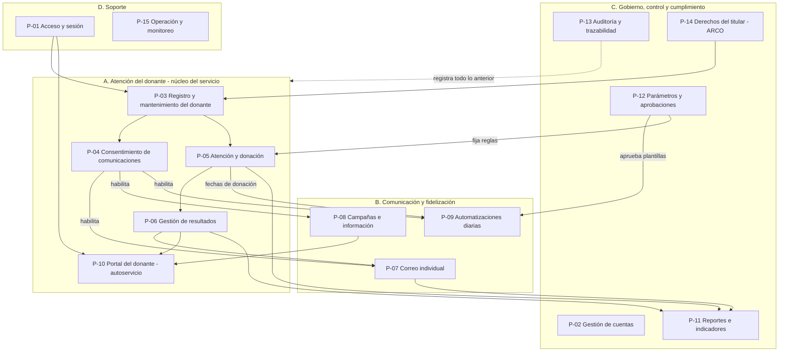
```mermaid
flowchart TB
  subgraph F1["A. Atención del donante - núcleo del servicio"]
    P03["P-03 Registro y mantenimiento del donante"]
    P04["P-04 Consentimiento de comunicaciones"]
    P05["P-05 Atención y donación"]
    P06["P-06 Gestión de resultados"]
    P10["P-10 Portal del donante - autoservicio"]
  end

  subgraph F2["B. Comunicación y fidelización"]
    P07["P-07 Correo individual"]
    P08["P-08 Campañas e información"]
    P09["P-09 Automatizaciones diarias"]
  end

  subgraph F3["C. Gobierno, control y cumplimiento"]
    P02["P-02 Gestión de cuentas"]
    P12["P-12 Parámetros y aprobaciones"]
    P13["P-13 Auditoría y trazabilidad"]
    P14["P-14 Derechos del titular - ARCO"]
    P11["P-11 Reportes e indicadores"]
  end

  subgraph F4["D. Soporte"]
    P01["P-01 Acceso y sesión"]
    P15["P-15 Operación y monitoreo"]
  end

  P01 --> P03
  P01 --> P10
  P03 --> P04
  P03 --> P05
  P05 --> P06
  P06 --> P07
  P04 -->|"habilita"| P07
  P04 -->|"habilita"| P08
  P04 -->|"habilita"| P09
  P12 -->|"aprueba plantillas"| P09
  P12 -->|"fija reglas"| P05
  P05 -->|"fechas de donación"| P09
  P06 --> P10
  P08 --> P10
  P14 --> P03
  P05 --> P11
  P06 --> P11
  P07 --> P11
  P13 -.->|"registra todo lo anterior"| F1
```

---

## 2. Catálogo de procesos

| Cód. | Proceso | Disparador | Actores | Resultado | Dónde en el sistema |
|---|---|---|---|---|---|
| **P-01** | Acceso y sesión | Usuario abre el portal | Todos | Sesión iniciada y pantalla según rol | `app/page.tsx`, Mi cuenta |
| **P-02** | Gestión de cuentas | Llega personal nuevo o un donante pide acceso | ADM | Cuenta creada, contraseña nueva, cuenta activa/inactiva, permiso de liberar | *Cuentas de acceso*, `/api/admin/users*` |
| **P-03** | Registro y mantenimiento del donante | Persona nueva en ventanilla, o lista para importar | ENF, MED, ADM | Donante en el padrón con datos válidos | *Inicio → Registrar*, *Donantes*, *Importar* |
| **P-04** | Consentimiento de comunicaciones | Donante acepta o retira recibir correos | ENF, DON | Consentimiento vigente o revocado, con versión e historial | *Ficha → Correos y consentimiento*; portal del donante |
| **P-05** | Atención y donación | Donante se presenta a donar | ENF, MED | Donación registrada y resultado pendiente creado | *Inicio* (buscador), *Ficha*, *Registrar donación* |
| **P-06** | Gestión de resultados | Se registra una donación; pasan las horas | MED, ENF | Resultado liberado y avisado, o marcado crítico | *Resultados* |
| **P-07** | Correo individual | Personal decide escribir a un donante | ENF, MED | Correo enviado y registrado | *Correos enviados → Enviar un correo* |
| **P-08** | Campañas e información | Hace falta sangre o difundir un mensaje | ENF, MED | Campaña enviada a un grupo; información publicada en el portal | *Campañas e información* |
| **P-09** | Automatizaciones diarias | Reloj (08:00, 08:15, 08:30, 08:45 hora Lima) | RELOJ, SIS | Cumpleaños, recordatorios, agradecimientos y reconocimientos enviados | `automations/worker.py`, `/api/automations/run` |
| **P-10** | Portal del donante (autoservicio) | Donante entra con su DNI | DON | Conoce su estado, resultado, campañas y dónde donar; gestiona avisos y sus datos | `DonorPortal` |
| **P-11** | Reportes e indicadores | Jefatura o equipo pide cifras | ENF, MED, ADM | Indicadores en pantalla y archivos CSV | *Reportes* |
| **P-12** | Parámetros y aprobaciones | Cambia una regla, un texto o hay que habilitar mensajes | ADM | Reglas, textos y plantillas vigentes y aprobados | *Parámetros* |
| **P-13** | Auditoría y trazabilidad | Ocurre cualquier cambio relevante | SIS (registra), ADM (consulta) | Bitácora de quién hizo qué y cuándo | *Actividad*, triggers `audit_row_change` |
| **P-14** | Derechos del titular (ARCO) | Donante pide copia, corrección, baja o eliminación | DON, ENF, ADM | Datos entregados, corregidos, avisos desactivados o anonimización | *Ficha → Datos y privacidad*, portal → *Más opciones* |
| **P-15** | Operación y monitoreo | Despliegue, falla o rutina diaria | Equipo técnico, ADM | Sistema disponible; reloj vivo; correos revisados | Vercel, Render, UptimeRobot, *Correos enviados* |

---

## 3. Procesos detallados

Cada diagrama usa **carriles por actor** (subgrafos). Las líneas punteadas indican una acción del sistema; los rombos, decisiones.

### P-01 · Acceso y sesión

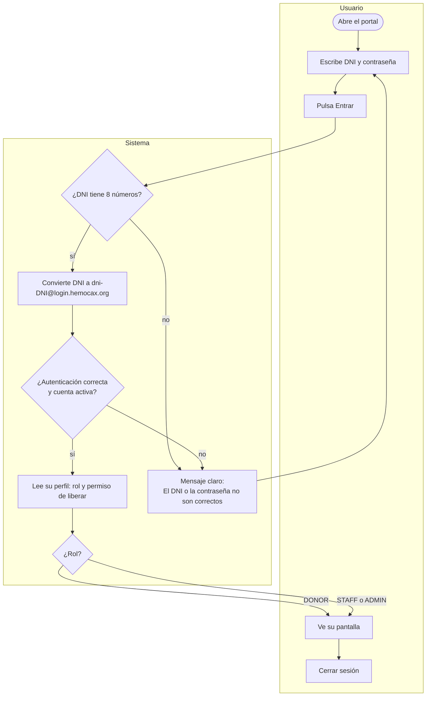
```mermaid
flowchart TD
  subgraph U["Usuario"]
    a1(["Abre el portal"]) --> a2["Escribe DNI y contraseña"]
    a2 --> a3["Pulsa Entrar"]
    a9["Ve su pantalla"]
    a10["Cerrar sesión"]
  end
  subgraph S["Sistema"]
    b1{"¿DNI tiene 8 números?"}
    b2["Convierte DNI a dni-DNI@login.hemocax.org"]
    b3{"¿Autenticación correcta<br/>y cuenta activa?"}
    b4["Lee su perfil: rol y permiso de liberar"]
    b5{"¿Rol?"}
    b6["Mensaje claro:<br/>El DNI o la contraseña no son correctos"]
  end
  a3 --> b1
  b1 -->|no| b6
  b1 -->|sí| b2 --> b3
  b3 -->|no| b6
  b3 -->|sí| b4 --> b5
  b5 -->|"DONOR"| a9
  b5 -->|"STAFF o ADMIN"| a9
  a9 --> a10
  b6 --> a2
```

**Controles:** sin auto-registro; cuentas inactivas no entran (`current_role()` las ignora); mensaje de error genérico (no revela si el DNI existe); la contraseña puede verse con «Mostrar lo que escribo».
**Variante – cambio de contraseña:** *Mi cuenta* (personal, mín. 12 caracteres) o *Más opciones* (donante, mín. 8).

---

### P-02 · Gestión de cuentas

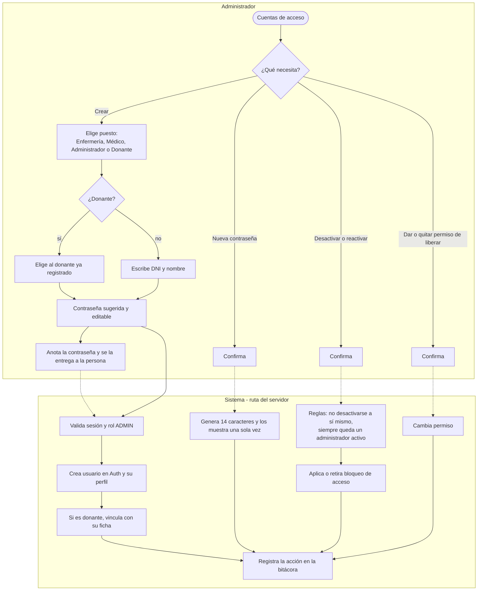
```mermaid
flowchart TD
  subgraph ADM["Administrador"]
    a1(["Cuentas de acceso"]) --> a2{"¿Qué necesita?"}
    a2 -->|"Crear"| a3["Elige puesto:<br/>Enfermería, Médico, Administrador o Donante"]
    a3 --> a4{"¿Donante?"}
    a4 -->|sí| a5["Elige al donante ya registrado"]
    a4 -->|no| a6["Escribe DNI y nombre"]
    a5 --> a7["Contraseña sugerida y editable"]
    a6 --> a7
    a7 --> a8["Anota la contraseña y se la entrega a la persona"]
    a2 -->|"Nueva contraseña"| a9["Confirma"]
    a2 -->|"Desactivar o reactivar"| a10["Confirma"]
    a2 -->|"Dar o quitar permiso de liberar"| a11["Confirma"]
  end
  subgraph SIS["Sistema - ruta del servidor"]
    b1["Valida sesión y rol ADMIN"]
    b2["Crea usuario en Auth y su perfil"]
    b3["Si es donante, vincula con su ficha"]
    b4["Genera 14 caracteres y los muestra una sola vez"]
    b5["Aplica o retira bloqueo de acceso"]
    b6["Reglas: no desactivarse a sí mismo,<br/>siempre queda un administrador activo"]
    b7["Cambia permiso"]
    b8["Registra la acción en la bitácora"]
  end
  a8 -.-> b1
  a7 --> b1
  b1 --> b2 --> b3 --> b8
  a9 -.-> b4 --> b8
  a10 -.-> b6 --> b5 --> b8
  a11 -.-> b7 --> b8
```

**Controles:** solo ADM; si un paso de la creación falla se revierte todo; la contraseña nunca se guarda en claro ni se vuelve a mostrar; toda acción queda en *Actividad*.

---

### P-03 · Registro y mantenimiento del donante

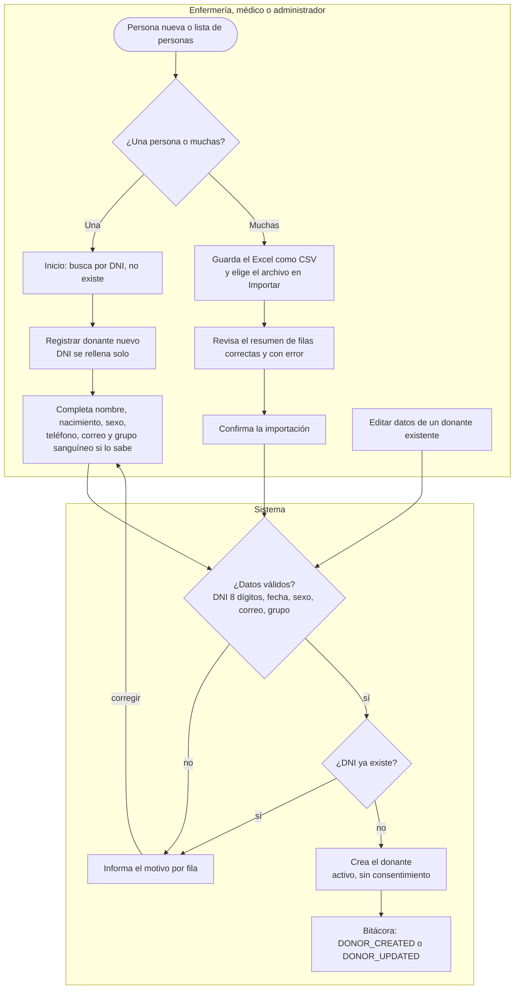
```mermaid
flowchart TD
  subgraph PER["Enfermería, médico o administrador"]
    a1(["Persona nueva o lista de personas"]) --> a2{"¿Una persona o muchas?"}
    a2 -->|"Una"| a3["Inicio: busca por DNI, no existe"]
    a3 --> a4["Registrar donante nuevo<br/>DNI se rellena solo"]
    a4 --> a5["Completa nombre, nacimiento, sexo,<br/>teléfono, correo y grupo sanguíneo si lo sabe"]
    a2 -->|"Muchas"| a6["Guarda el Excel como CSV<br/>y elige el archivo en Importar"]
    a6 --> a7["Revisa el resumen de filas correctas y con error"]
    a7 --> a8["Confirma la importación"]
    a9["Editar datos de un donante existente"]
  end
  subgraph SIS["Sistema"]
    b1{"¿Datos válidos?<br/>DNI 8 dígitos, fecha, sexo, correo, grupo"}
    b2{"¿DNI ya existe?"}
    b3["Crea el donante<br/>activo, sin consentimiento"]
    b4["Informa el motivo por fila"]
    b5["Bitácora: DONOR_CREATED o DONOR_UPDATED"]
  end
  a5 --> b1
  a8 --> b1
  a9 --> b1
  b1 -->|no| b4
  b1 -->|sí| b2
  b2 -->|sí| b4
  b2 -->|no| b3 --> b5
  b4 -->|"corregir"| a5
```

**Controles:** el grupo sanguíneo puede quedar vacío («No sé»); la importación **no** da consentimiento (se registra aparte); los donantes no se borran, se **inactivan** o se **anonimizan** (P-14).

---

### P-04 · Consentimiento de comunicaciones

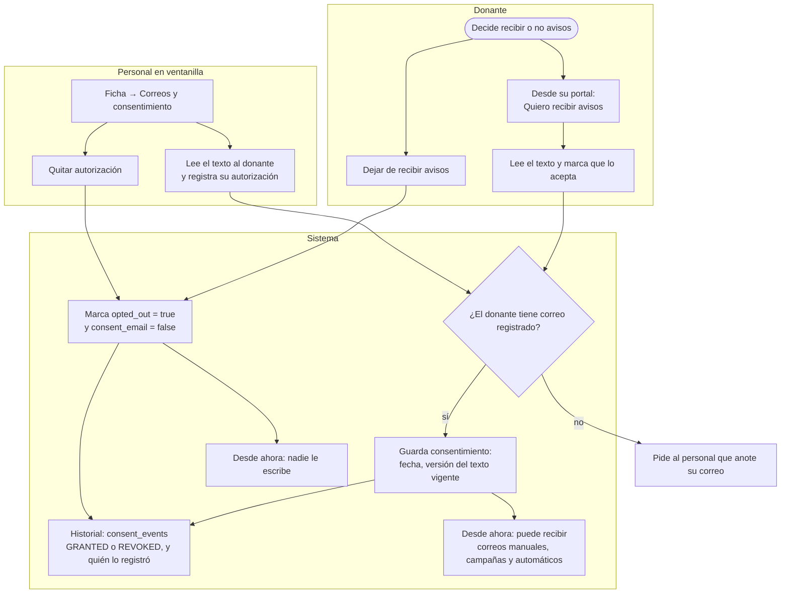
```mermaid
flowchart TD
  subgraph DON["Donante"]
    d1(["Decide recibir o no avisos"])
    d2["Desde su portal:<br/>Quiero recibir avisos"]
    d3["Lee el texto y marca que lo acepta"]
    d4["Dejar de recibir avisos"]
  end
  subgraph ENF["Personal en ventanilla"]
    e1["Ficha → Correos y consentimiento"]
    e2["Lee el texto al donante<br/>y registra su autorización"]
    e3["Quitar autorización"]
  end
  subgraph SIS["Sistema"]
    s1{"¿El donante tiene correo registrado?"}
    s2["Guarda consentimiento:<br/>fecha, versión del texto vigente"]
    s3["Marca opted_out = true<br/>y consent_email = false"]
    s4["Historial: consent_events<br/>GRANTED o REVOKED, y quién lo registró"]
    s5["Desde ahora: puede recibir<br/>correos manuales, campañas y automáticos"]
    s6["Desde ahora: nadie le escribe"]
  end
  d1 --> d2 --> d3 --> s1
  d1 --> d4 --> s3
  e1 --> e2 --> s1
  e1 --> e3 --> s3
  s1 -->|no| x1["Pide al personal que anote su correo"]
  s1 -->|sí| s2 --> s4
  s3 --> s4
  s2 --> s5
  s3 --> s6
```

**Controles:** el texto vigente está versionado (`consent_versions`); se guarda quién lo registró (`DONOR`, `STAFF` o `SISTEMA`); sin consentimiento y correo no hay comunicación, aunque alguien lo intente (lo valida la ruta y la consulta de candidatos).

---

### P-05 · Atención y donación

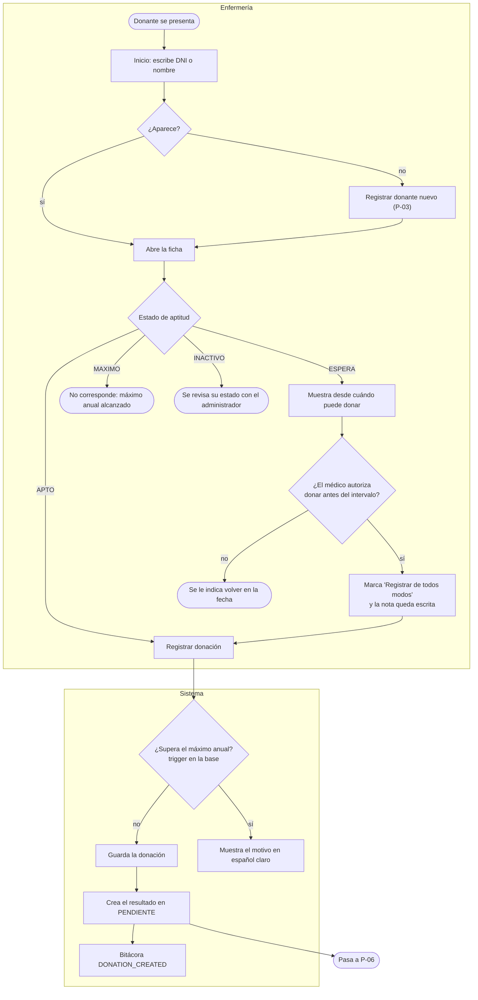
```mermaid
flowchart TD
  subgraph ENF["Enfermería"]
    a1(["Donante se presenta"]) --> a2["Inicio: escribe DNI o nombre"]
    a2 --> a3{"¿Aparece?"}
    a3 -->|no| a4["Registrar donante nuevo (P-03)"]
    a3 -->|sí| a5["Abre la ficha"]
    a4 --> a5
    a5 --> a6{"Estado de aptitud"}
    a6 -->|"APTO"| a7["Registrar donación"]
    a6 -->|"ESPERA"| a8["Muestra desde cuándo puede donar"]
    a8 --> a9{"¿El médico autoriza<br/>donar antes del intervalo?"}
    a9 -->|sí| a10["Marca 'Registrar de todos modos'<br/>y la nota queda escrita"]
    a9 -->|no| a11(["Se le indica volver en la fecha"])
    a10 --> a7
    a6 -->|"MAXIMO"| a12(["No corresponde: máximo anual alcanzado"])
    a6 -->|"INACTIVO"| a13(["Se revisa su estado con el administrador"])
  end
  subgraph SIS["Sistema"]
    b1{"¿Supera el máximo anual?<br/>trigger en la base"}
    b2["Guarda la donación"]
    b3["Crea el resultado en PENDIENTE"]
    b4["Bitácora DONATION_CREATED"]
    b5["Muestra el motivo en español claro"]
  end
  a7 --> b1
  b1 -->|sí| b5
  b1 -->|no| b2 --> b3 --> b4
  b3 --> n1(["Pasa a P-06"])
```

**Controles:** el máximo anual (4 H / 3 M) lo impone la **base de datos** y serializa registros simultáneos; el intervalo mínimo lo advierte la pantalla y exige una confirmación explícita del médico; la fecha de “hoy” se calcula en hora de Lima.

---

### P-06 · Gestión de resultados

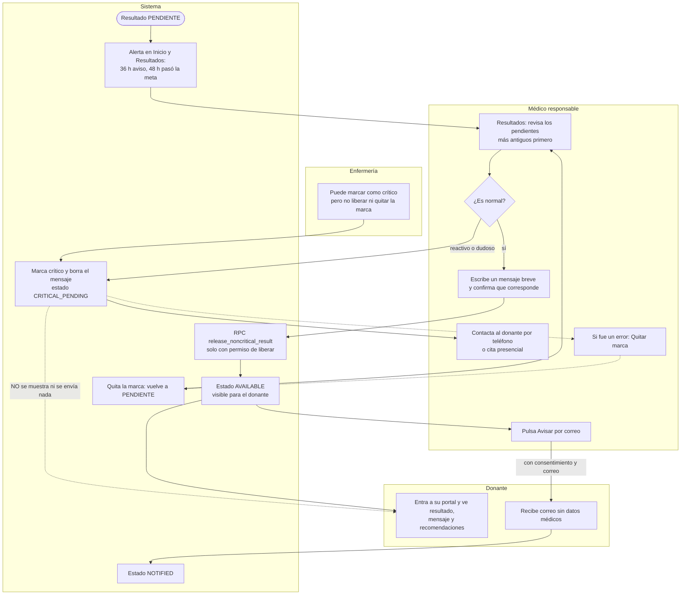
```mermaid
flowchart TD
  subgraph SIS["Sistema"]
    s0(["Resultado PENDIENTE"])
    s1["Alerta en Inicio y Resultados:<br/>36 h aviso, 48 h pasó la meta"]
    s2["RPC release_noncritical_result<br/>solo con permiso de liberar"]
    s3["Estado AVAILABLE<br/>visible para el donante"]
    s4["Marca crítico y borra el mensaje<br/>estado CRITICAL_PENDING"]
    s5["Quita la marca: vuelve a PENDIENTE"]
    s6["Estado NOTIFIED"]
  end
  subgraph MED["Médico responsable"]
    m1["Resultados: revisa los pendientes<br/>más antiguos primero"]
    m2{"¿Es normal?"}
    m3["Escribe un mensaje breve y confirma que corresponde"]
    m4["Pulsa Avisar por correo"]
    m5["Contacta al donante por teléfono<br/>o cita presencial"]
    m6["Si fue un error: Quitar marca"]
  end
  subgraph ENF["Enfermería"]
    e1["Puede marcar como crítico<br/>pero no liberar ni quitar la marca"]
  end
  subgraph DON["Donante"]
    d1["Entra a su portal y ve resultado,<br/>mensaje y recomendaciones"]
    d2["Recibe correo sin datos médicos"]
  end
  s0 --> s1 --> m1 --> m2
  m2 -->|sí| m3 --> s2 --> s3
  m2 -->|"reactivo o dudoso"| s4
  e1 --> s4
  s4 --> m5
  s4 -.-> m6 -.-> s5 --> m1
  s3 --> m4
  m4 -->|"con consentimiento y correo"| d2 --> s6
  s3 --> d1
  s4 -.->|"NO se muestra ni se envía nada"| d1
```

**Controles (críticos, tres capas):** la pantalla no ofrece liberarlo; la función SQL lo rechaza; la política RLS impide que el donante lo lea. Cada cambio queda en la bitácora con su responsable. El correo **nunca** lleva datos médicos: solo invita a entrar al portal.

---

### P-07 · Correo individual

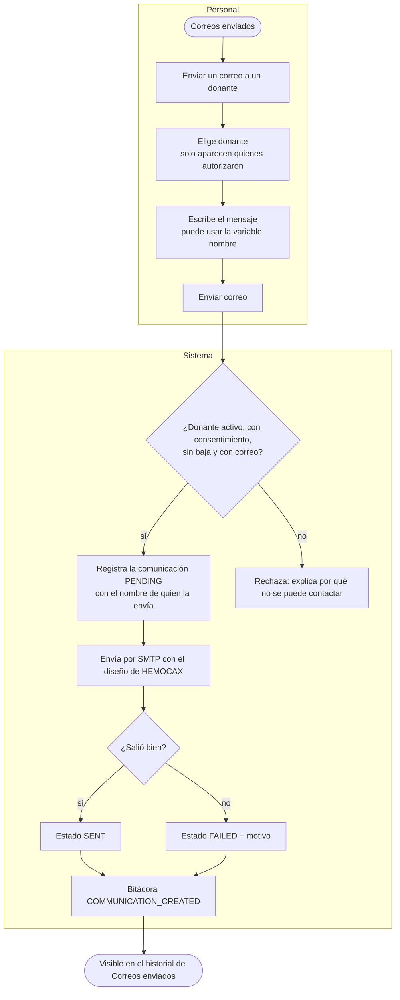
```mermaid
flowchart TD
  subgraph PER["Personal"]
    a1(["Correos enviados"]) --> a2["Enviar un correo a un donante"]
    a2 --> a3["Elige donante<br/>solo aparecen quienes autorizaron"]
    a3 --> a4["Escribe el mensaje<br/>puede usar la variable nombre"]
    a4 --> a5["Enviar correo"]
  end
  subgraph SIS["Sistema"]
    b1{"¿Donante activo, con consentimiento,<br/>sin baja y con correo?"}
    b2["Registra la comunicación PENDING<br/>con el nombre de quien la envía"]
    b3["Envía por SMTP con el diseño de HEMOCAX"]
    b4{"¿Salió bien?"}
    b5["Estado SENT"]
    b6["Estado FAILED + motivo"]
    b7["Rechaza: explica por qué no se puede contactar"]
    b8["Bitácora COMMUNICATION_CREATED"]
  end
  a5 --> b1
  b1 -->|no| b7
  b1 -->|sí| b2 --> b3 --> b4
  b4 -->|sí| b5 --> b8
  b4 -->|no| b6 --> b8
  b8 --> h(["Visible en el historial de Correos enviados"])
```

---

### P-08 · Campañas e información

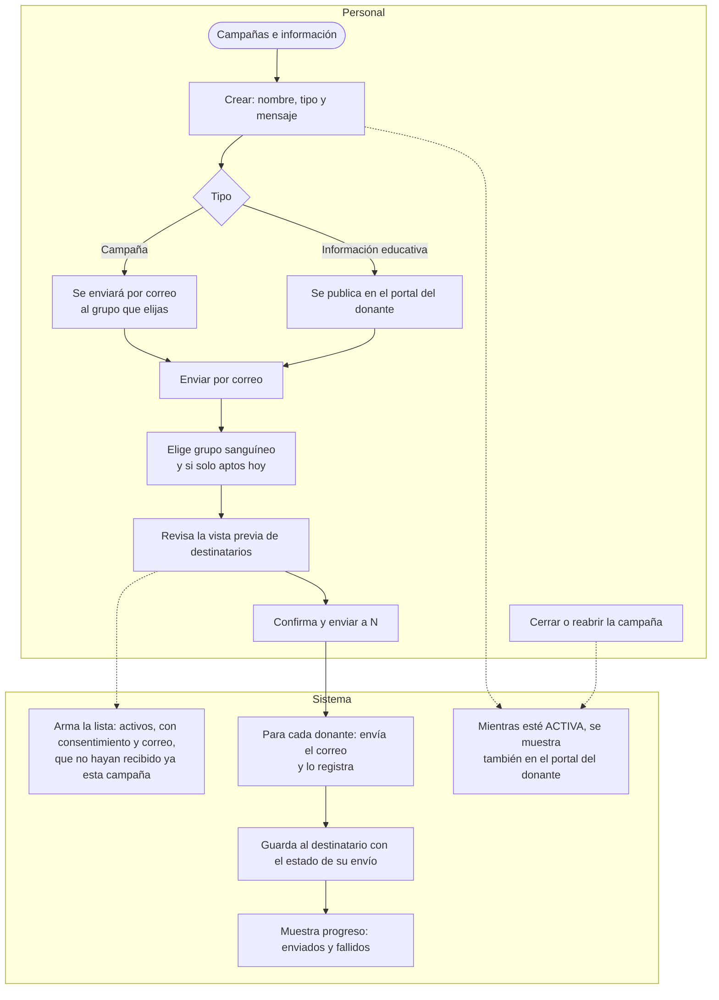
```mermaid
flowchart TD
  subgraph PER["Personal"]
    a1(["Campañas e información"]) --> a2["Crear: nombre, tipo y mensaje"]
    a2 --> a3{"Tipo"}
    a3 -->|"Campaña"| a4["Se enviará por correo<br/>al grupo que elijas"]
    a3 -->|"Información educativa"| a5["Se publica en el portal del donante"]
    a4 --> a6["Enviar por correo"]
    a5 --> a6
    a6 --> a7["Elige grupo sanguíneo<br/>y si solo aptos hoy"]
    a7 --> a8["Revisa la vista previa de destinatarios"]
    a8 --> a9["Confirma y enviar a N"]
    a10["Cerrar o reabrir la campaña"]
  end
  subgraph SIS["Sistema"]
    b1["Arma la lista: activos, con consentimiento y correo,<br/>que no hayan recibido ya esta campaña"]
    b2["Para cada donante: envía el correo<br/>y lo registra"]
    b3["Guarda al destinatario con el estado de su envío"]
    b4["Muestra progreso: enviados y fallidos"]
    b5["Mientras esté ACTIVA, se muestra<br/>también en el portal del donante"]
  end
  a8 -.-> b1
  a9 --> b2 --> b3 --> b4
  a2 -.-> b5
  a10 -.-> b5
```

**Controles:** vista previa obligatoria antes de confirmar; nadie recibe dos veces la misma campaña (restricción única); solo se contacta a quien consintió. **Estados de la campaña:** `ACTIVE` ↔ `CLOSED`.

---

### P-09 · Automatizaciones diarias

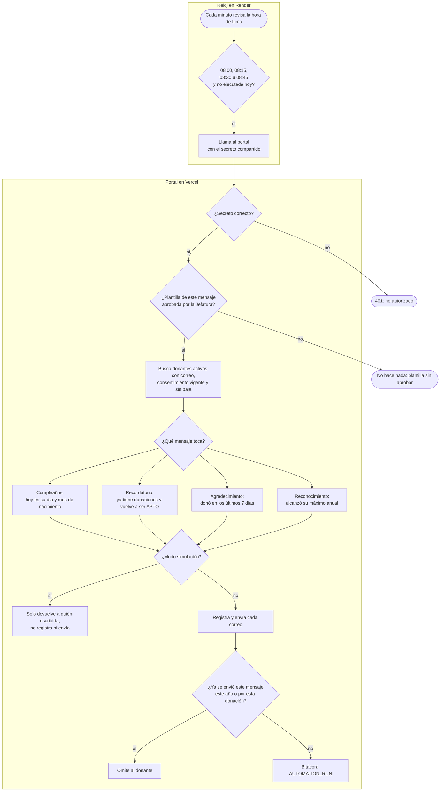
```mermaid
flowchart TD
  subgraph RELOJ["Reloj en Render"]
    r1(["Cada minuto revisa la hora de Lima"])
    r2{"08:00, 08:15,<br/>08:30 u 08:45<br/>y no ejecutada hoy?"}
    r3["Llama al portal<br/>con el secreto compartido"]
    r1 --> r2
    r2 -->|sí| r3
  end
  subgraph SIS["Portal en Vercel"]
    s1{"¿Secreto correcto?"}
    s2{"¿Plantilla de este mensaje<br/>aprobada por la Jefatura?"}
    s3["Busca donantes activos con correo,<br/>consentimiento vigente y sin baja"]
    s4{"¿Qué mensaje toca?"}
    c1["Cumpleaños:<br/>hoy es su día y mes de nacimiento"]
    c2["Recordatorio:<br/>ya tiene donaciones y vuelve a ser APTO"]
    c3["Agradecimiento:<br/>donó en los últimos 7 días"]
    c4["Reconocimiento:<br/>alcanzó su máximo anual"]
    s5{"¿Modo simulación?"}
    s6["Solo devuelve a quién escribiría,<br/>no registra ni envía"]
    s7["Registra y envía cada correo"]
    s8{"¿Ya se envió este mensaje<br/>este año o por esta donación?"}
    s9["Omite al donante"]
    s10["Bitácora AUTOMATION_RUN"]
  end
  r3 --> s1
  s1 -->|no| x1(["401: no autorizado"])
  s1 -->|sí| s2
  s2 -->|no| x2(["No hace nada: plantilla sin aprobar"])
  s2 -->|sí| s3 --> s4
  s4 --> c1 & c2 & c3 & c4
  c1 & c2 & c3 & c4 --> s5
  s5 -->|sí| s6
  s5 -->|no| s7 --> s8
  s8 -->|sí| s9
  s8 -->|no| s10
```

| Mensaje | Hora (Lima) | Se envía como máximo… |
|---|---|---|
| Cumpleaños | 08:00 | 1 vez por donante y año |
| Recordatorio de retorno | 08:15 | 1 vez por donación (nunca a quien jamás donó) |
| Agradecimiento | 08:30 | 1 vez por donación |
| Reconocimiento anual | 08:45 | 1 vez por donante y año |

**Controles:** triple compuerta (secreto + plantilla aprobada + consentimiento); modo simulación por defecto; duplicados imposibles por índices únicos.

---

### P-10 · Portal del donante (autoservicio)

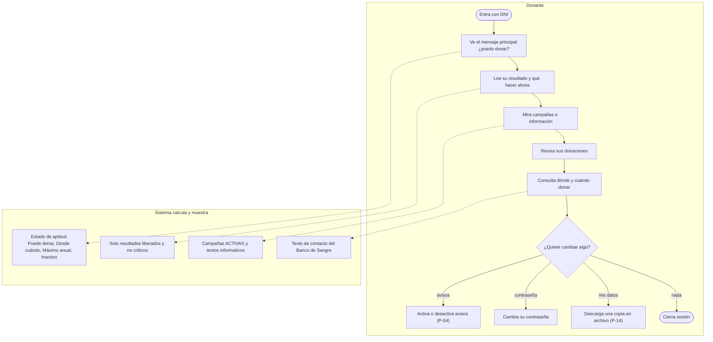
```mermaid
flowchart TD
  subgraph DON["Donante"]
    a1(["Entra con DNI"]) --> a2["Ve el mensaje principal:<br/>¿puedo donar?"]
    a2 --> a3["Lee su resultado y qué hacer ahora"]
    a3 --> a4["Mira campañas e información"]
    a4 --> a5["Revisa sus donaciones"]
    a5 --> a6["Consulta dónde y cuándo donar"]
    a6 --> a7{"¿Quiere cambiar algo?"}
    a7 -->|"avisos"| a8["Activa o desactiva avisos (P-04)"]
    a7 -->|"contraseña"| a9["Cambia su contraseña"]
    a7 -->|"mis datos"| a10["Descarga una copia en archivo (P-14)"]
    a7 -->|"nada"| a11(["Cierra sesión"])
  end
  subgraph SIS["Sistema calcula y muestra"]
    s1["Estado de aptitud:<br/>Puede donar, Desde cuándo, Máximo anual, Inactivo"]
    s2["Solo resultados liberados y no críticos"]
    s3["Campañas ACTIVAS y textos informativos"]
    s4["Texto de contacto del Banco de Sangre"]
  end
  a2 -.-> s1
  a3 -.-> s2
  a4 -.-> s3
  a6 -.-> s4
```

**Pensado para zonas rurales:** una sola pantalla, letra grande, íconos y colores, frases cortas, carga liviana; 1 columna en celular y 2 en escritorio.

---

### P-11 · Reportes e indicadores

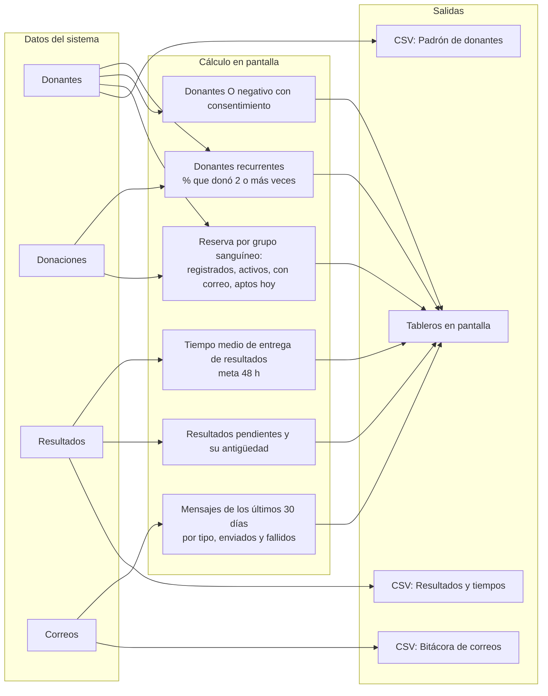
```mermaid
flowchart LR
  subgraph FUENTES["Datos del sistema"]
    f1["Donantes"]
    f2["Donaciones"]
    f3["Resultados"]
    f4["Correos"]
  end
  subgraph CALC["Cálculo en pantalla"]
    c1["Donantes recurrentes<br/>% que donó 2 o más veces"]
    c2["Tiempo medio de entrega de resultados<br/>meta 48 h"]
    c3["Donantes O negativo con consentimiento"]
    c4["Mensajes de los últimos 30 días<br/>por tipo, enviados y fallidos"]
    c5["Reserva por grupo sanguíneo:<br/>registrados, activos, con correo, aptos hoy"]
    c6["Resultados pendientes y su antigüedad"]
  end
  subgraph SAL["Salidas"]
    o1["Tableros en pantalla"]
    o2["CSV: Padrón de donantes"]
    o3["CSV: Bitácora de correos"]
    o4["CSV: Resultados y tiempos"]
  end
  f1 --> c1 & c3 & c5
  f2 --> c1 & c5
  f3 --> c2 & c6
  f4 --> c4
  c1 & c2 & c3 & c4 & c5 & c6 --> o1
  f1 --> o2
  f4 --> o3
  f3 --> o4
```

---

### P-12 · Parámetros y aprobaciones

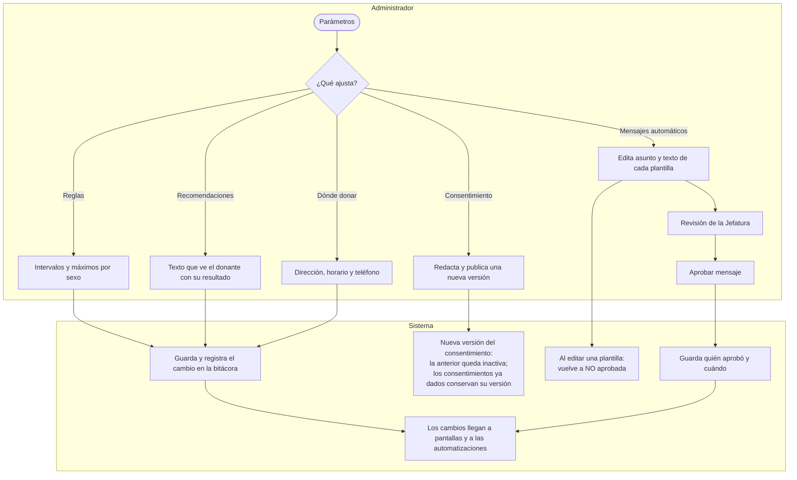
```mermaid
flowchart TD
  subgraph ADM["Administrador"]
    a1(["Parámetros"]) --> a2{"¿Qué ajusta?"}
    a2 -->|"Reglas"| a3["Intervalos y máximos por sexo"]
    a2 -->|"Recomendaciones"| a4["Texto que ve el donante con su resultado"]
    a2 -->|"Dónde donar"| a5["Dirección, horario y teléfono"]
    a2 -->|"Consentimiento"| a6["Redacta y publica una nueva versión"]
    a2 -->|"Mensajes automáticos"| a7["Edita asunto y texto de cada plantilla"]
    a7 --> a8["Revisión de la Jefatura"]
    a8 --> a9["Aprobar mensaje"]
  end
  subgraph SIS["Sistema"]
    s1["Guarda y registra el cambio en la bitácora"]
    s2["Nueva versión del consentimiento:<br/>la anterior queda inactiva;<br/>los consentimientos ya dados conservan su versión"]
    s3["Al editar una plantilla:<br/>vuelve a NO aprobada"]
    s4["Guarda quién aprobó y cuándo"]
    s5["Los cambios llegan a pantallas y a las automatizaciones"]
  end
  a3 --> s1
  a4 --> s1
  a5 --> s1
  a6 --> s2
  a7 --> s3
  a9 --> s4
  s1 --> s5
  s4 --> s5
```

**Control clave:** sin aprobación **no sale ningún mensaje automático**. Pendiente conocido: el trigger de la base tiene el máximo anual fijo (ver README, 19.3).

---

### P-13 · Auditoría y trazabilidad

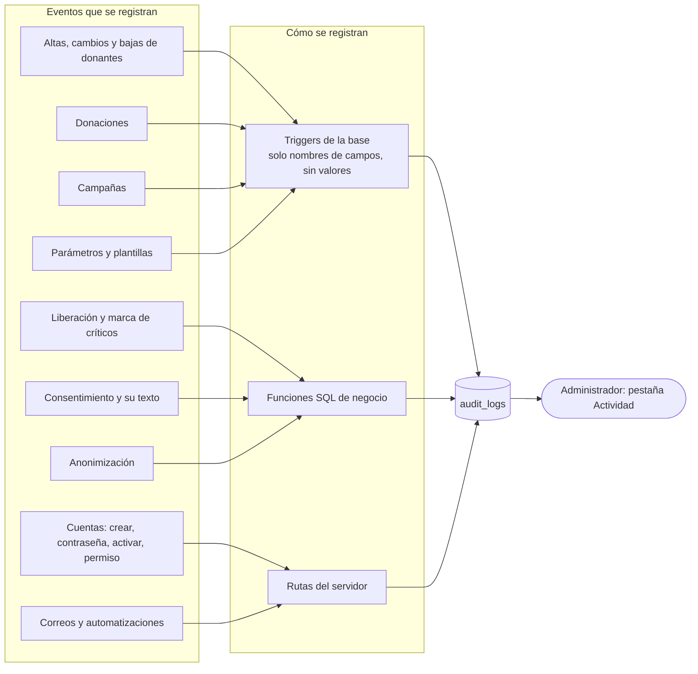
```mermaid
flowchart LR
  subgraph EV["Eventos que se registran"]
    e1["Altas, cambios y bajas de donantes"]
    e2["Donaciones"]
    e3["Campañas"]
    e4["Parámetros y plantillas"]
    e5["Liberación y marca de críticos"]
    e6["Consentimiento y su texto"]
    e7["Cuentas: crear, contraseña, activar, permiso"]
    e8["Correos y automatizaciones"]
    e9["Anonimización"]
  end
  subgraph REG["Cómo se registran"]
    r1["Triggers de la base<br/>solo nombres de campos, sin valores"]
    r2["Funciones SQL de negocio"]
    r3["Rutas del servidor"]
  end
  A[("audit_logs")]
  C(["Administrador: pestaña Actividad"])
  e1 & e2 & e3 & e4 --> r1
  e5 & e6 & e9 --> r2
  e7 & e8 --> r3
  r1 & r2 & r3 --> A --> C
```

**Control:** solo el administrador puede leer la bitácora; guarda **qué** campo cambió, no su valor (minimización de datos).

---

### P-14 · Derechos del titular (ARCO)

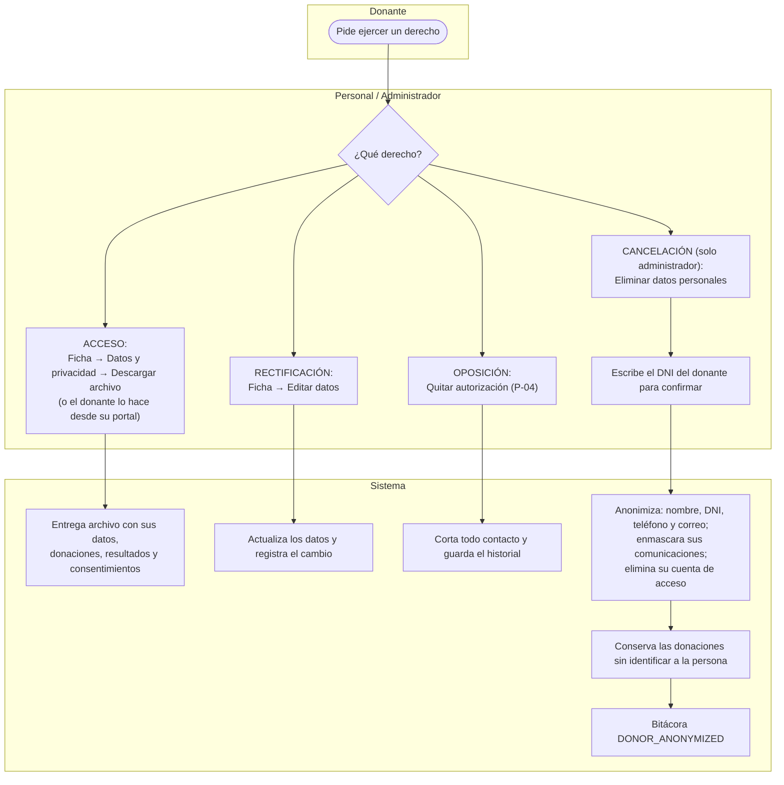
```mermaid
flowchart TD
  subgraph DON["Donante"]
    d1(["Pide ejercer un derecho"])
  end
  subgraph ENF["Personal / Administrador"]
    p1{"¿Qué derecho?"}
    p2["ACCESO:<br/>Ficha → Datos y privacidad → Descargar archivo<br/>(o el donante lo hace desde su portal)"]
    p3["RECTIFICACIÓN:<br/>Ficha → Editar datos"]
    p4["OPOSICIÓN:<br/>Quitar autorización (P-04)"]
    p5["CANCELACIÓN (solo administrador):<br/>Eliminar datos personales"]
    p6["Escribe el DNI del donante para confirmar"]
  end
  subgraph SIS["Sistema"]
    s1["Entrega archivo con sus datos,<br/>donaciones, resultados y consentimientos"]
    s2["Actualiza los datos y registra el cambio"]
    s3["Corta todo contacto y guarda el historial"]
    s4["Anonimiza: nombre, DNI, teléfono y correo;<br/>enmascara sus comunicaciones;<br/>elimina su cuenta de acceso"]
    s5["Conserva las donaciones sin identificar a la persona"]
    s6["Bitácora DONOR_ANONYMIZED"]
  end
  d1 --> p1
  p1 --> p2 --> s1
  p1 --> p3 --> s2
  p1 --> p4 --> s3
  p1 --> p5 --> p6 --> s4 --> s5 --> s6
```

---

### P-15 · Operación y monitoreo

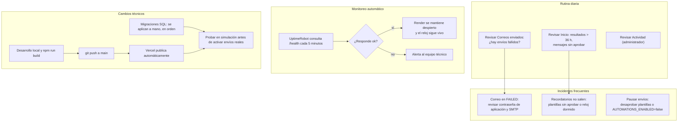
```mermaid
flowchart TD
  subgraph DIA["Rutina diaria"]
    d1["Revisar Correos enviados:<br/>¿hay envíos fallidos?"]
    d2["Revisar Inicio: resultados > 36 h,<br/>mensajes sin aprobar"]
    d3["Revisar Actividad (administrador)"]
  end
  subgraph MON["Monitoreo automático"]
    m1["UptimeRobot consulta /health cada 5 minutos"]
    m2{"¿Responde ok?"}
    m3["Render se mantiene despierto<br/>y el reloj sigue vivo"]
    m4["Alerta al equipo técnico"]
  end
  subgraph CAM["Cambios técnicos"]
    c1["Desarrollo local y npm run build"]
    c2["git push a main"]
    c3["Vercel publica automáticamente"]
    c4["Migraciones SQL: se aplican a mano, en orden"]
    c5["Probar en simulación antes de activar envíos reales"]
  end
  subgraph INC["Incidentes frecuentes"]
    i1["Correo en FAILED:<br/>revisar contraseña de aplicación y SMTP"]
    i2["Recordatorios no salen:<br/>plantillas sin aprobar o reloj dormido"]
    i3["Pausar envíos:<br/>desaprobar plantillas o AUTOMATIONS_ENABLED=false"]
  end
  m1 --> m2
  m2 -->|sí| m3
  m2 -->|no| m4
  d1 --> i1
  d2 --> i2
  c1 --> c2 --> c3
  c4 --> c5
  c3 --> c5
```

---

## 4. Procesos × roles

✅ puede ejecutarlo · 👁 solo consulta · ➖ no participa. **ENF** enfermería, **MED** médico responsable, **ADM** administrador, **DON** donante.

| Cód. | Proceso | ENF | MED | ADM | DON |
|---|---|:---:|:---:|:---:|:---:|
| P-01 | Acceso y sesión; cambio de contraseña propia | ✅ | ✅ | ✅ | ✅ |
| P-02 | Gestión de cuentas | ➖ | ➖ | ✅ | ➖ |
| P-03 | Registro y mantenimiento del donante | ✅ | ✅ | ✅ | ➖ |
| P-04 | Consentimiento de comunicaciones | ✅ (registra) | ✅ (registra) | ✅ (registra) | ✅ (el suyo) |
| P-05 | Atención y donación | ✅ | ✅ | ✅ | ➖ |
| P-06 | Resultados: marcar como crítico | ✅ | ✅ | ✅ | ➖ |
| P-06 | Resultados: **liberar** y **quitar la marca** | ➖ | ✅ | ✅ (con permiso) | ➖ |
| P-06 | Resultados: avisar por correo | ✅ | ✅ | ✅ | ➖ |
| P-07 | Correo individual | ✅ | ✅ | ✅ | ➖ |
| P-08 | Campañas e información | ✅ | ✅ | ✅ | 👁 (las activas) |
| P-09 | Automatizaciones | ➖ | ➖ | 👁 (aprueba plantillas) | ➖ |
| P-10 | Portal del donante | ➖ | ➖ | ➖ | ✅ |
| P-11 | Reportes e indicadores | ✅ | ✅ | ✅ | ➖ |
| P-12 | Parámetros y aprobaciones | ➖ | ➖ | ✅ | 👁 (las claves públicas) |
| P-13 | Auditoría (consulta) | ➖ | ➖ | ✅ | ➖ |
| P-14 | ARCO: acceso y rectificación | ✅ | ✅ | ✅ | ✅ (descarga la suya) |
| P-14 | ARCO: cancelación (anonimizar) | ➖ | ➖ | ✅ | ➖ |
| P-15 | Operación y monitoreo | 👁 | 👁 | ✅ | ➖ |

> «ADM (con permiso)»: el administrador puede liberar resultados si su cuenta tiene `can_release_results`.

---

## 5. Procesos × datos (CRUD)

**C** crea · **R** lee · **U** actualiza · **D** elimina. Entre paréntesis, *cómo*: **(T)** por trigger, **(F)** por función SQL, **(S)** por ruta del servidor.

| Cód. | `donors` | `donations` | `donation_results` | `communications` | `campaigns` / `recipients` | `consent_*` | `message_templates` | `system_config` | `profiles` / Auth | `audit_logs` |
|---|---|---|---|---|---|---|---|---|---|---|
| P-01 | | | | | | | | | R | |
| P-02 | U (vincula) (S) | | | | | | | | C U (S) | C (S) |
| P-03 | C R U | | | | | eventos C (T) | | R | | C (T) |
| P-04 | U | | | | | eventos C (T), versiones R | | | | C (T) |
| P-05 | R | C R | C (T) | | | | | R | | C (T) |
| P-06 | R | R | R U (F) | C U (S) | | | | | | C (F) |
| P-07 | R | | | C R U (S) | | | | | R | C (S) |
| P-08 | R | R | | C (S) | C R U / C R | | | R | | C (T) |
| P-09 | R | R | | C U (S) | | | R | R | | C (S) |
| P-10 | R U (consent.) | R | R | | R | R | | R | R | |
| P-11 | R | R | R | R | | | | R | | |
| P-12 | | | | | | versiones C U (F) | R U | R U | | C (T/F) |
| P-13 | | | | | | | | | | R |
| P-14 | R U (F) | R | R | U (F) | | R | | | D cuenta (S) | C (F) |

---

## 6. Dependencias entre procesos

Qué necesita cada proceso de los demás (flecha: «alimenta a»).

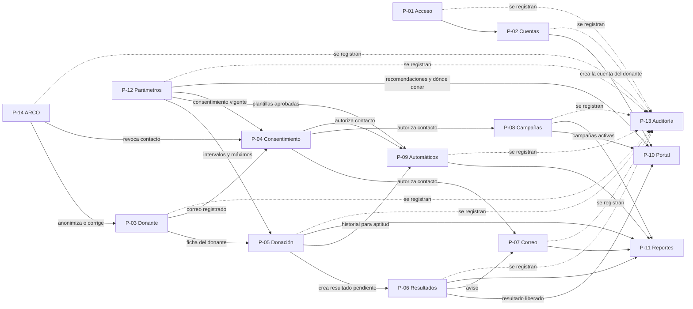
```mermaid
flowchart LR
  P01["P-01 Acceso"] --> P02["P-02 Cuentas"]
  P02 -->|"crea la cuenta del donante"| P10["P-10 Portal"]
  P03["P-03 Donante"] -->|"ficha del donante"| P05["P-05 Donación"]
  P03 -->|"correo registrado"| P04["P-04 Consentimiento"]
  P04 -->|"autoriza contacto"| P07["P-07 Correo"]
  P04 -->|"autoriza contacto"| P08["P-08 Campañas"]
  P04 -->|"autoriza contacto"| P09["P-09 Automáticos"]
  P05 -->|"crea resultado pendiente"| P06["P-06 Resultados"]
  P05 -->|"historial para aptitud"| P09
  P06 -->|"resultado liberado"| P10
  P06 -->|"aviso"| P07
  P08 -->|"campañas activas"| P10
  P12["P-12 Parámetros"] -->|"intervalos y máximos"| P05
  P12 -->|"plantillas aprobadas"| P09
  P12 -->|"consentimiento vigente"| P04
  P12 -->|"recomendaciones y dónde donar"| P10
  P14["P-14 ARCO"] -->|"anonimiza o corrige"| P03
  P14 -->|"revoca contacto"| P04
  P05 & P06 & P07 & P08 & P09 --> P11["P-11 Reportes"]
  P01 & P02 & P03 & P05 & P06 & P07 & P08 & P09 & P12 & P14 -.->|"se registran"| P13["P-13 Auditoría"]
```

### Ciclo de vida completo del donante (de punta a punta)

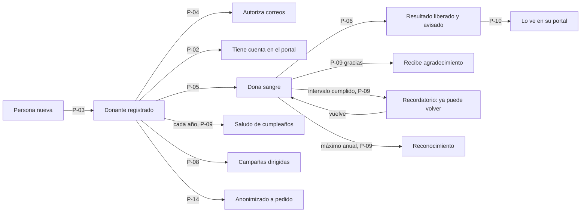
```mermaid
flowchart LR
  A["Persona nueva"] -->|"P-03"| B["Donante registrado"]
  B -->|"P-04"| C["Autoriza correos"]
  B -->|"P-02"| D["Tiene cuenta en el portal"]
  B -->|"P-05"| E["Dona sangre"]
  E -->|"P-06"| F["Resultado liberado y avisado"]
  F -->|"P-10"| G["Lo ve en su portal"]
  E -->|"P-09 gracias"| H["Recibe agradecimiento"]
  E -->|"intervalo cumplido, P-09"| I["Recordatorio: ya puede volver"]
  I -->|"vuelve"| E
  E -->|"máximo anual, P-09"| J["Reconocimiento"]
  B -->|"cada año, P-09"| K["Saludo de cumpleaños"]
  B -->|"P-08"| L["Campañas dirigidas"]
  B -->|"P-14"| M["Anonimizado a pedido"]
```

---

## 7. Controles transversales

| Control | Dónde se aplica | Procesos |
|---|---|---|
| **Autorización en la base de datos** (RLS y funciones) | Todas las tablas | P-01 a P-14 |
| **Consentimiento vigente antes de contactar** | Ruta de envío y consulta de candidatos | P-07, P-08, P-09 |
| **Plantilla aprobada antes de enviar automáticos** | Ruta de automatización | P-09, P-12 |
| **Modo simulación por defecto** | Variable `AUTOMATION_DRY_RUN` | P-07, P-08, P-09 |
| **Sin duplicados de correo** | Índices únicos en `communications` y `campaign_recipients` | P-08, P-09 |
| **Resultados críticos fuera del canal digital** | Pantalla + función SQL + RLS | P-06, P-10 |
| **Máximo anual** | Trigger en `donations` | P-05 |
| **Bitácora automática** | Triggers, funciones y rutas | Todos |
| **Mensajes sin datos médicos** | Textos de correo y plantillas | P-06, P-07, P-09 |
| **Anonimización irreversible con confirmación** | Escribir el DNI del donante | P-14 |

## 8. Indicadores por proceso (cómo se mide cada uno)

| Proceso | Indicador | Dónde se ve |
|---|---|---|
| P-03 / P-04 | % de donantes activos con correo autorizado | *Reportes* |
| P-05 | Donaciones registradas hoy | *Inicio* |
| P-05 / P-09 | % de donantes recurrentes (≥ 2 donaciones) | *Reportes* |
| P-06 | Tiempo medio de entrega de resultados; pendientes > 48 h | *Reportes*, alertas de *Inicio* |
| P-07 / P-08 / P-09 | Mensajes de 30 días por tipo, enviados vs. fallidos | *Reportes*, *Correos enviados* |
| P-08 | Donantes O negativo con consentimiento; reserva por grupo | *Reportes* |
| P-12 | Mensajes automáticos sin aprobar | Alerta en *Inicio* (administrador) |
